# Details of Serial Queries and Results

The following queries and results were executed serially, so that only one query was ever executing at a time on either the GeoWave or GeoMesa system.

This is not a complete list of the queries; that can be found in the source code for the service endpoints.
We will consider and analyze only a subset that we found interesting.

> Disclaimer
>
> These are simple a few ways of looking at the data that we found useful,
> after looking at the data in many different ways. We don't claim that these
> results are definitive, or that they tell the whole story. One reason for
> putting a repeatable process for others to perform these tests and analyze
> results (besides transparency, and the general spirit of FLOSS, and the
> techniques being more generally useful) is so that _you_ could perform the
> tests and dissect the results however _you_ think is best. What follows is
> a window into how we have dissected the results, and the conclusions we have
> drawn from those.

###### Notes
- In the following results, if we specify that outliers were removed, they were removed via the interquartile range rule.
- All maps were generated with `geojson.io`, basemaps © OpenStreetMap contributors

Throughout all results, unless otherwise noted, we will be following this general color scheme:

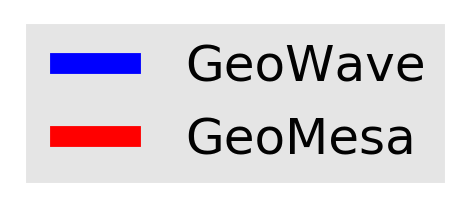

### GeoLife

Test for GeoLife were performed on EMR 5.0.0 clusters of one m3.2xlarge master and three m3.2xlarge workers. The GeoLife dataset was ingested with default 2D and 3D indexes for both systems. See the appendix for details about machine specs and ingest results.

###### Spatial queries of Beijing

We used the Beijing geojson from Mapzen's borders dataset, which can be found in the resources of the `core` subproject. This represents the multipolygon seen below

We then queried the city of Beijing over the whole time of the dataset. We tracked results for both iterating over the resulting SimpleFeatures.
Here are the timing results for that test, with outliers removed:

These queries take a long time; this makes sense, as they are iterating over __19,902,865 results__.

###### Spatial queries of central Beijing

To test on queries with smaller result set, we using `geojson.io` to draw a rough polygon around the center of Beijing, we then performed spatial-only queries using this polygon:

This allowed us to track the iteration and count queries against a smaller spatial extent.
However, this query did not actually cut out too many results; the result set for this query included __16,624,351 results__.
In the following chart, outliers have been removed.

These two results show GeoMesa handling queries with large results faster than GeoWave, which is a result we've seen fairly consistently in our tests.

###### Spatial queries of bounding boxes across Beijing

This query cuts the bounding box of Beijing into `N` equal sized bounding boxes, represented by the tile coordinate `COL` and `ROW`.

For instance, running `N=32` would create bounding boxes that look like this:

We tested with `N=32`  `{ 2, 4, 8, 16, 32}`. This produced 1,024 unique queries.
417 were queries with 0 results, and were not considered.
103 of these queries did not produce the same result between GeoMesa and GeoWave;
a query for the entire bounding box of Beijing produces the same results, so it is unclear
why this mismatch occurs, and which system is incorrect.
Because these tests are focused on performance and not accuracy, these mismatched results are included
in the graphs below.

This graph plots the result count of each query against the duration of that query per system:

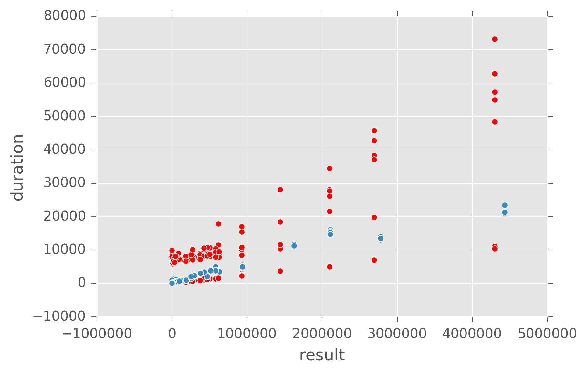

This shows GeoMesa having more variance over duration; however it does not give a good indication of trends.
If we plot a linear regression on the two set of points, we can see that although GeoMesa appears to have
more variance in query duration, the queries typically return faster from GeoMesa than from GeoWave, and this
trend becomes more pronounced as the number of results increases.

GeoMesa has a feature called "loose bbox" that allows you to trade performance for result accuracy;
it only uses the space filling curve to filter data and does no secondary filtering, so false positives
could be returned. The graph below includes a scatterplot and regression for the loose bounding box queries in yellow.

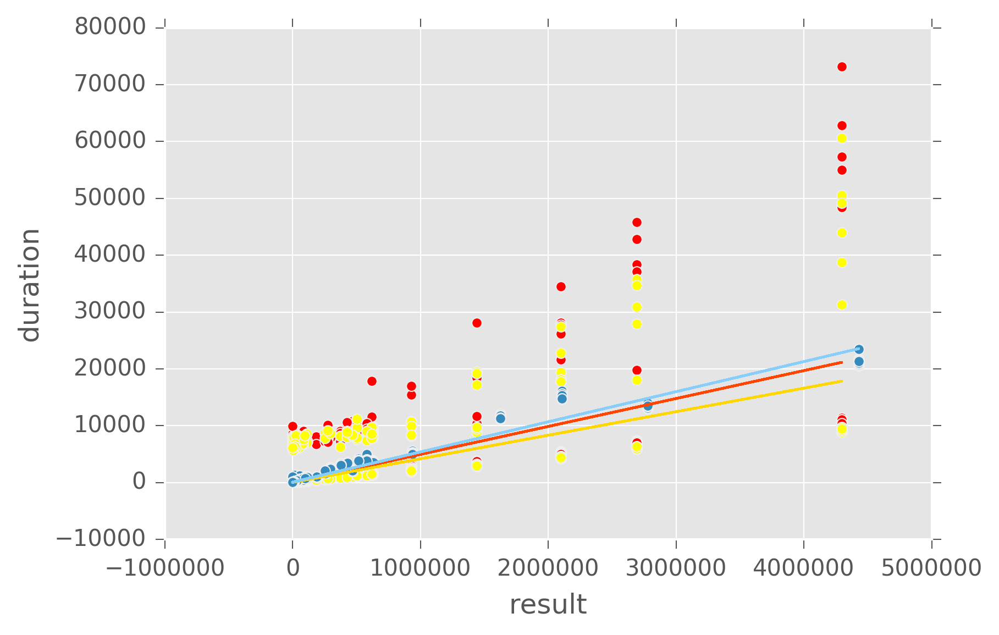

The following graph shows the regressions against queries returning less than 10,000 results.
It shows that even for queries with lower result counts, GeoMesa tends to slightly outperform GeoWave
for these spatial-only point data queries, for both loose and exact queries.

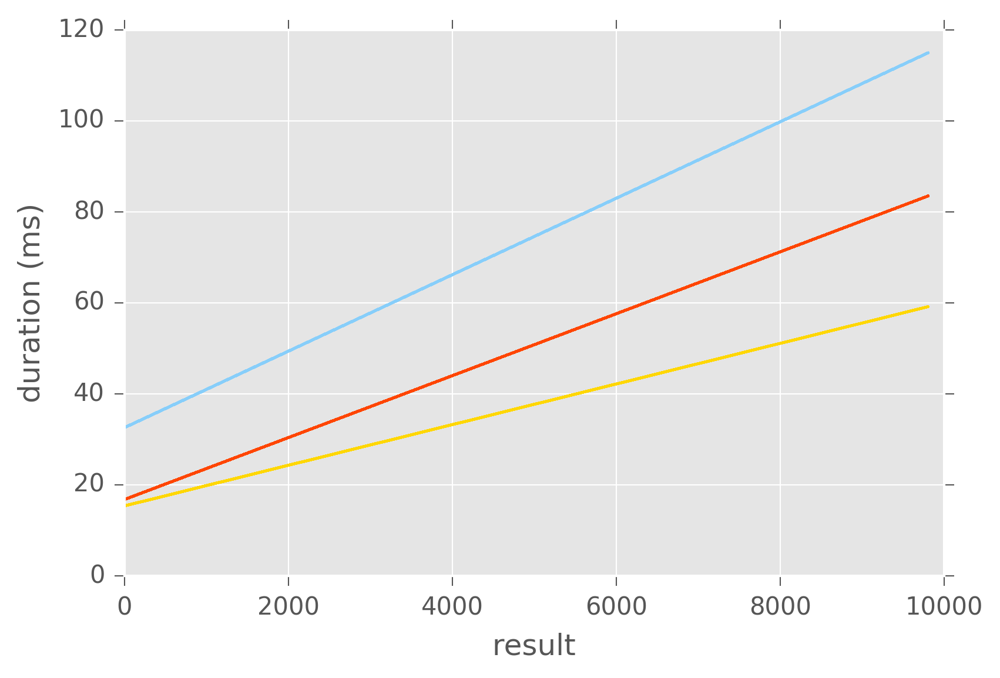

###### Spatiotemporal query results

In both systems, spatiotemporal queries (those with bounds in both space and time) hit a different table and indexing mechanism than the spatial-only queries described above.
To include a temporal aspect to our queries, we ran a query over the center of Beijing for the month of August in 2011. This returned __84,496 results__.
In the following chart, outliers have been removed.

We see that GeoMesa performs better in this query. If we plot the histogram of GeoMesa durations with outliers removed, for both
exact and loose (red and yellow, respectively), and compare it to the histogram of durations for GeoWave queries with outliers removed,
we see that there is a wider spread of timing results coming from GeoWave for this query.

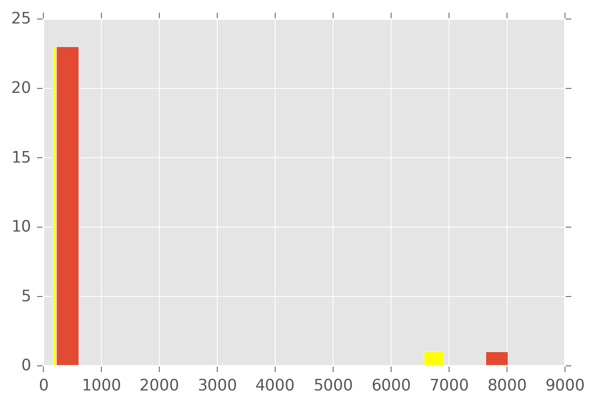
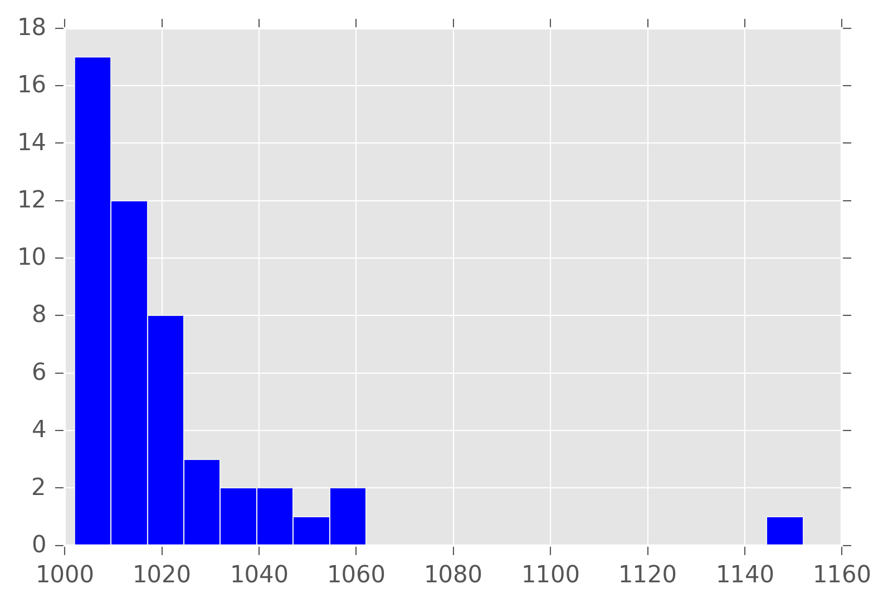

### GDELT

Test for GDELT were performed on EMR 5.0.0 clusters of one m3.2xlarge master and five m3.2xlarge workers.

##### Spatiotemporal queries of areas around cities: City Buffers

For these queries, which we call the "city buffer" tests, queries are taken from center points corresponding to the following cities:
Paris, Philadelphia, Istanbul, Baghdad, Tehran, Beijing, Tokyo, Oslo, Khartoum, and Johannesburg. For instance, the Paris city buffers
look like this:

The queries were taken over a set of these durations: six months, two months, two weeks, and six days.

Below is a scatter plot of duration by query result count.

We can see that GeoMesa has much less consistent results than GeoWave. If we plot a linear regression on
this point sets, we'll get the following:

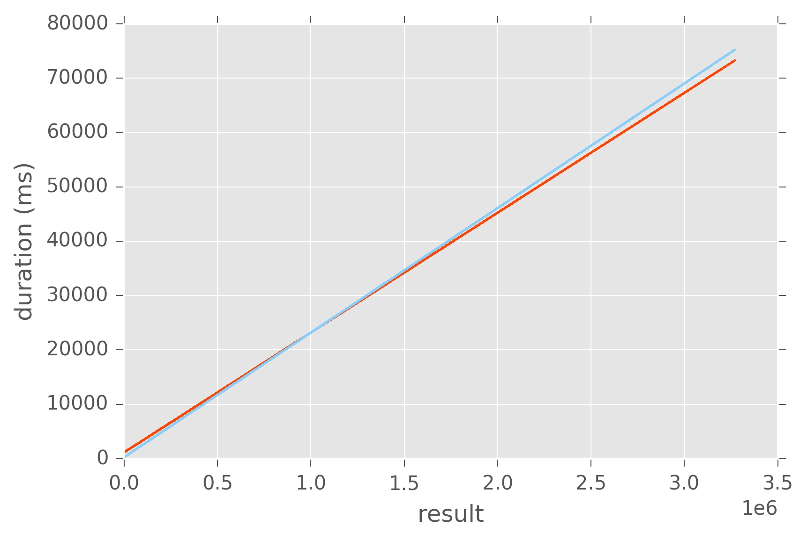

GeoMesa tends to be slower at returning these queries than GeoWave, until the queries return
a large number of results. According to the regression, after around 1 million results returned,
GeoMesa becomes faster than GeoWave. This is an imprecise result, but one that we have found
consistent over point datasets: GeoMesa generally does better with queries that produce
large result sets.

This next graph shows the mean duration of queries over all cities and all buffer sizes, for 14 day queries,
based on the result count of the queries. The x axis in this case represents a bin of result counts;
points were averaged according to a quantile-based discretization function of result count, which is represented here on the X axis as
the lowest result count of that grouping.

We see here that again GeoMesa appears to be slower than GeoWave, until a certain result count is reached,
after which it performs better.

If we take a look at the next graph, another pattern emerges. This graph moves the temporal bounds of
the query to 168 days.

We see GeoMesa performing worse than the 14 day case. In this case it
actually never crosses the threshold where it starts outperforming GeoWave based on result count (according
to this technique of averaging result count).

###### Index configurations

We hypothesized that some of the timing differences we were seeing here was because of differences in the configuration
of their indexing mechanisms. As described in the section comparing the index configurations, the default periodicity
for GeoMesa is one week, while in GeoWave it is one year. Also, GeoWave does not shard it's data by default.
To find out how this configuration might be affecting the timing results, we tested with both systems set
to having the following configuration:

- Both systems configured to have a periodicity of one month, with default sharding
- Both systems configured to have a periodicity of one year, with default sharding
- Both systems configured to have a periodicity of one year, with 4 shards being generated by a hashing algorithm

The last configuration produced improvements in timing results for the City Buffer queries, which we will explore below,
and be referred to as the "matched" index configuration.

This graph shows the durations of 14 day queries averages broken into the same result count quartiles.
We can see a marked improvement in GeoMesas results.

In the case of the 168 day queries, we see that although there is still a degradation of performance for GeoMesa,
it is not nearly as prominent as it was with the default indexing.

When we look at the overall timings based on result count, we can that GeoMesa seems to be slightly
outperformed by GeoWave until a certain result set size is reached.

If we focus in on query durations with relatively lower result counts, and plot GeoMesa and GeoWave results
with both the default and the matched index configuration, we see that both systems improve with the matched
index configuration, and that GeoWave outperforms GeoMesa in this case for both index configurations.

<!-- 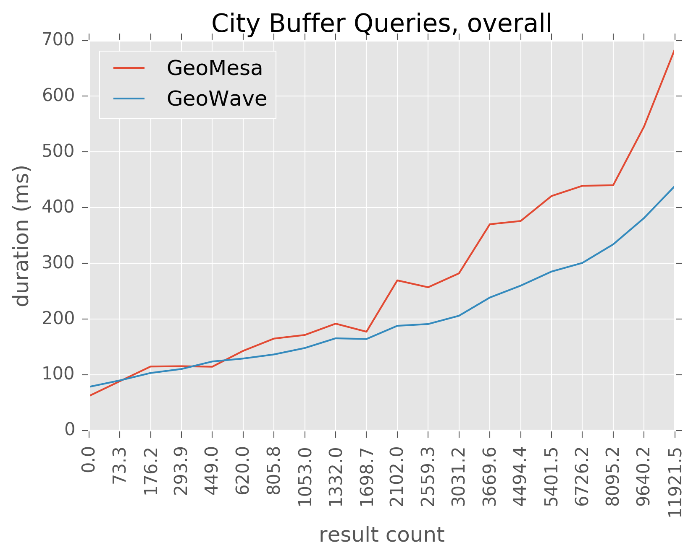 -->

If we only look at queries with time bounds that are less than 30 days, we see the GeoMesa matched index configuration
performing the best out of that group.

When we only consider queries over 30 days, we see a more marked advantage of GeoWave performance.

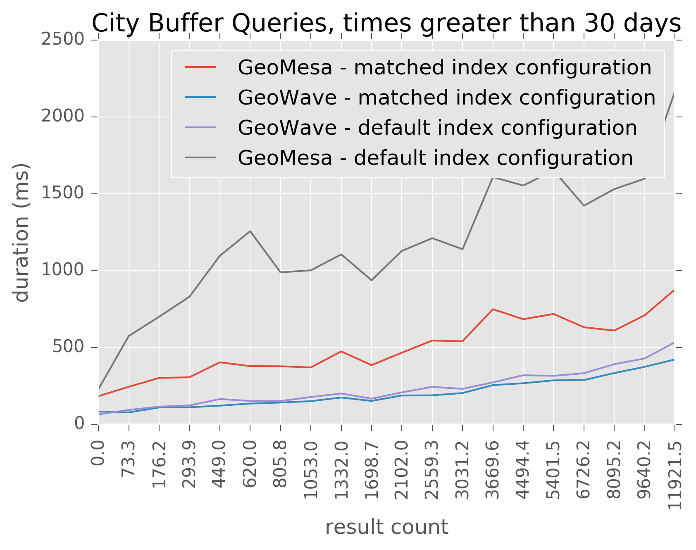

<!--  -->
<!-- 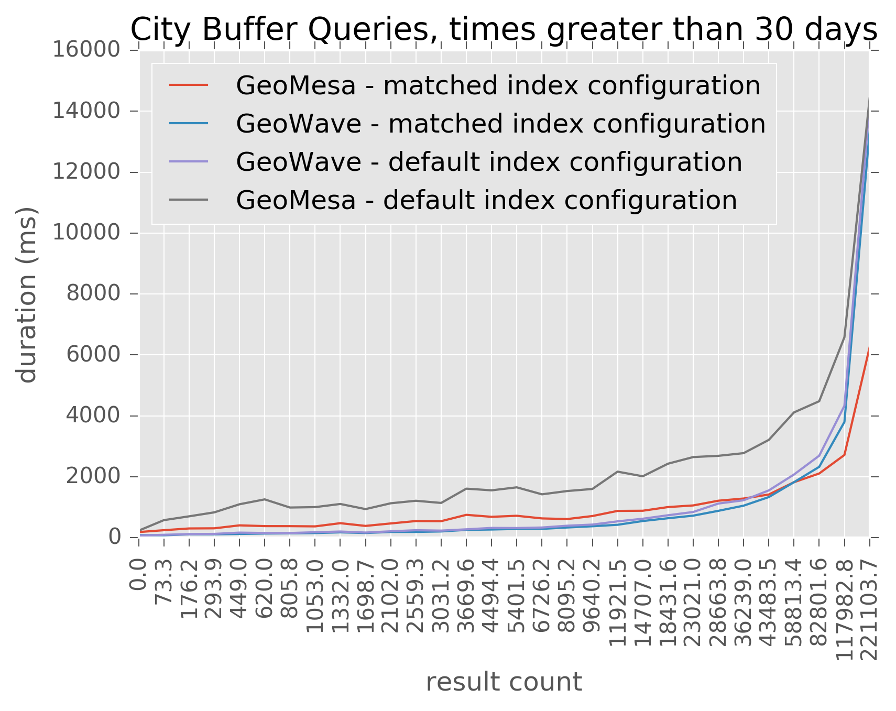 -->

Here is the duration of queries plotted over the temporal bounds of the query. We see that GeoMesa performs better for
queries with a small time window, and both GeoMesa and GeoWave show better performance with the matched index configuration.

Looking at the data in another way, we see that the size of the spatial component of the query
(shown in the x axis here in kilometers) does not have the same threshold-crossing effect as the temporal
component does, and that on average GeoWave outperforms GeoMesa across spatial queries.

Finally for the City Buffer tests, we look at how the scatterplot and regression
of durations over result counts changes between the default and the matched index configuration.

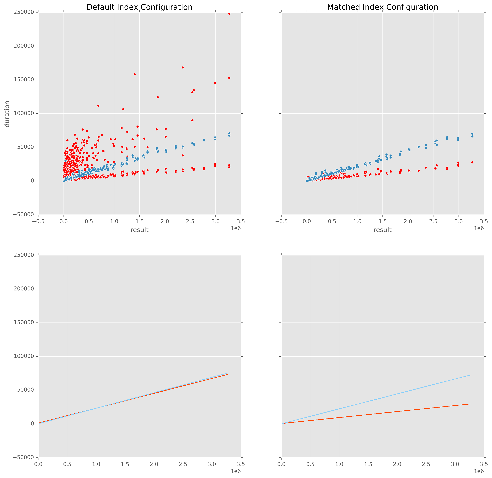

###### South America

We queried events within South america countries for three weeks of every month of every year from 2000 to 2016.

The results we found for this area of the world were unsurprising, with the matching index configuration
performing better in both systems than the default index configuration, and the effect of result count
having a greater effect on GeoWave performance than GeoMesa. The following chart is of the duration of
query execution over result size, with outliers removed.

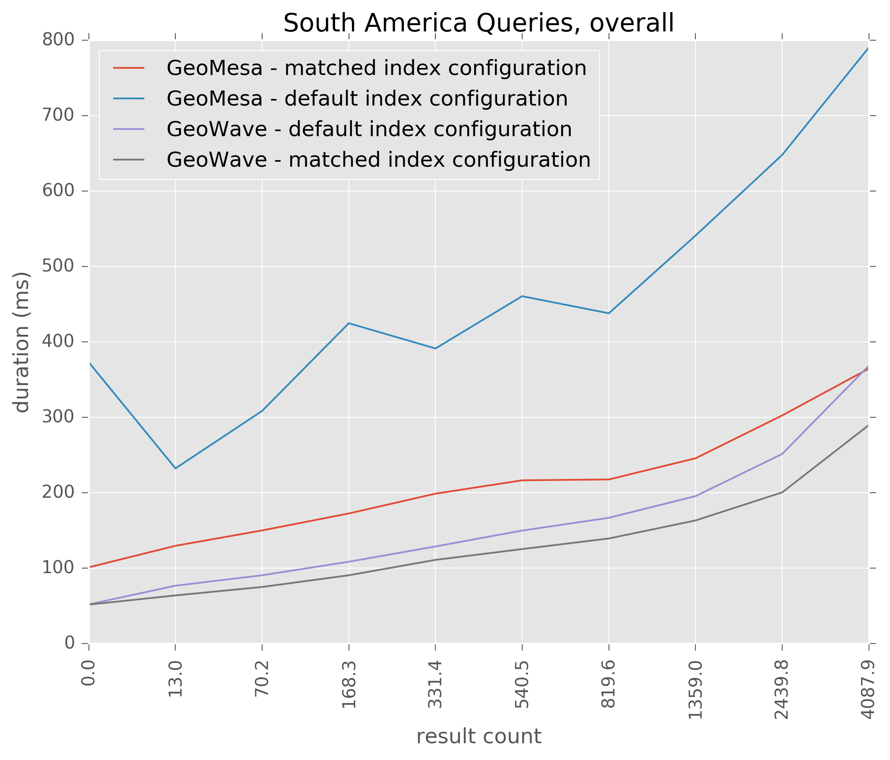

### Synthesized Tracks

Test for Tracks data were performed on EMR 5.0.0 clusters of one m3.2xlarge master and three m3.2xlarge workers.

We performed queries against a range of bounding boxes over the continental United States of America.
We project a powers of 2 pyramid over this area and query from pyramid level 4 to 7, with temporal bounds being one of
5 days, 18 days, 27 days, or one month. The beginning of the temporal bounds was selected from the range of time for which
data existed.

We refer to the spatial aspect of the bounding box queries according to "levels", where each level refers to a powers of 2 pyramid
over the bounding box of the US. Below is a depiction of those bounding boxes, to give a sense of scale.

##### Level 4

##### Level 5
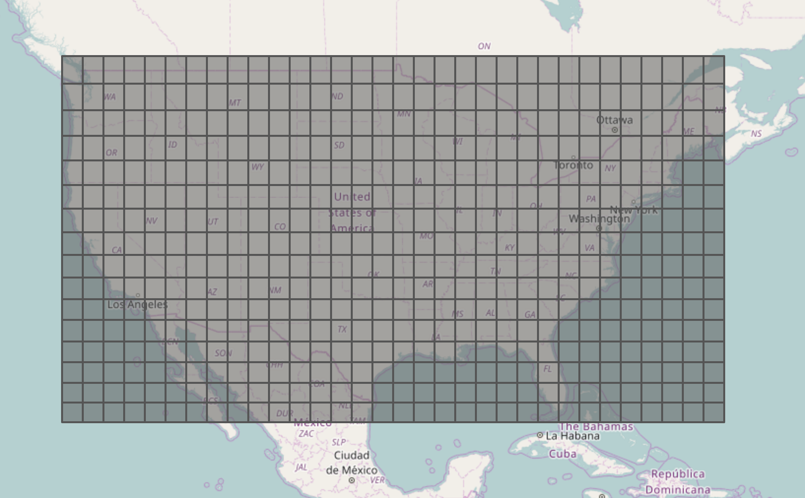
##### Level 6

##### Level 7

There is an pattern of behavior exhibited by the query results for the generated tracks dataset that bears some mention.  Consider the following graphs:

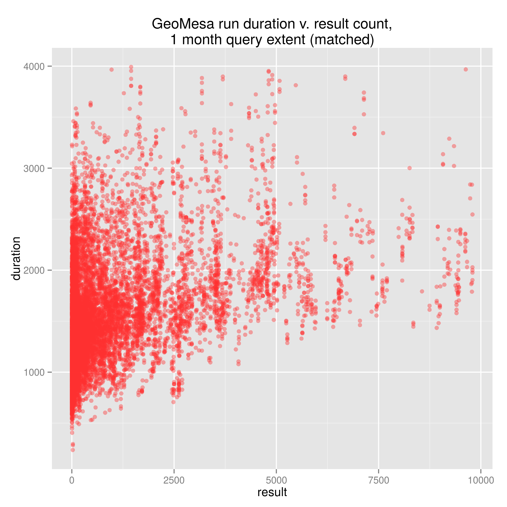

There is an indication of a gentle upward trend in both the case of GeoWave and GeoMesa; however, the GeoWave results exhibit an additional tendency for the returns to stratify.  This behavior is possibly an artifact of GeoWave's tiering strategy and would only appear in datasets with elements that exhibit a range of geometric extents, which is the case for this dataset.

Below is a chart that represents the distribution of durations for each system, as well as marking the mean duration.
It shows GeoMesa performing better on this dataset, which is consistent with our analysis.

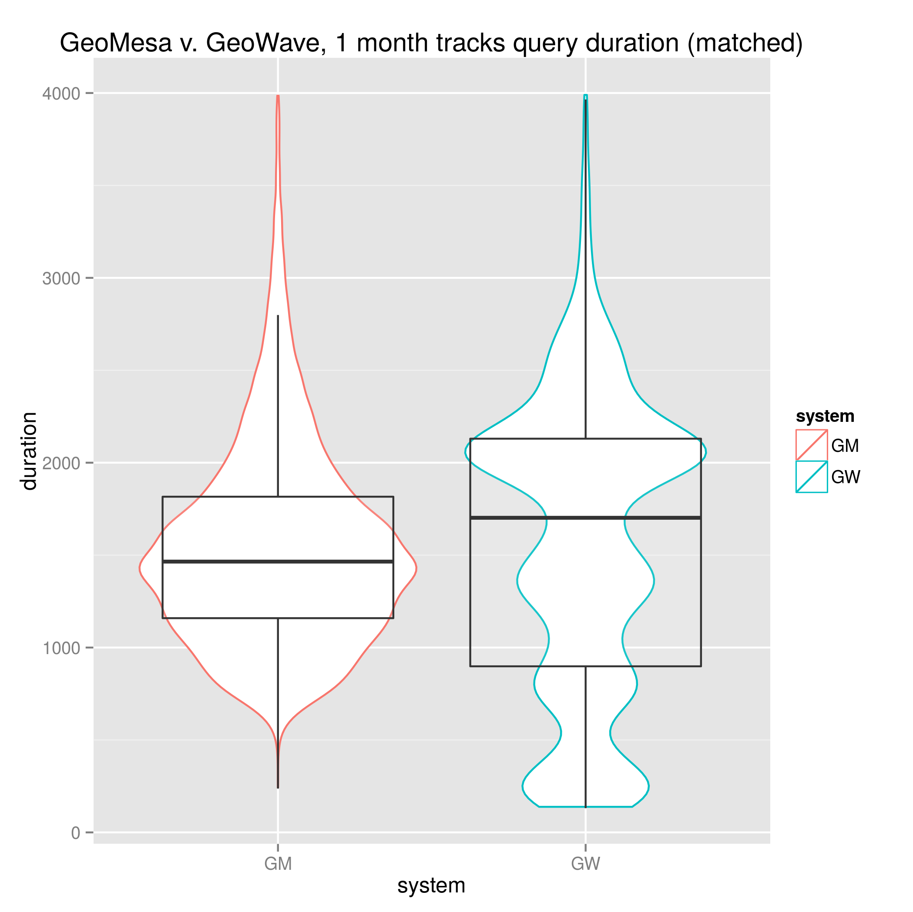

If we look at the mean durations over result count groupings according to a quantile-based discretization function of result count,
we see GeoMesa consistently outperforming GeoWave.

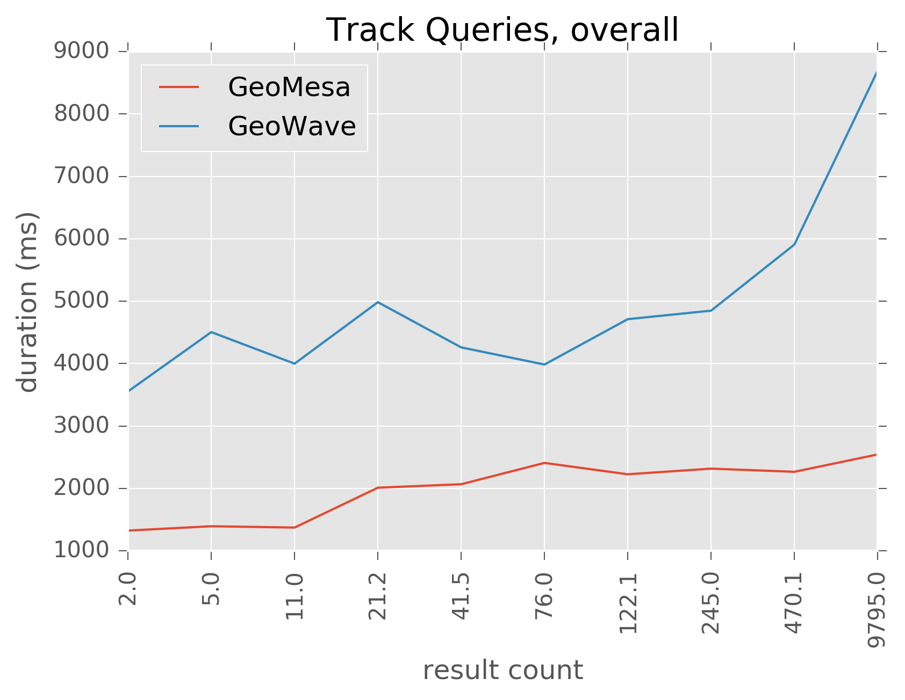

To understand if there is a relationship between the temporal bounds of the query and performance, we
can look at the above chart broken down by the 5 day, 18 day and 27 day queries. For GeoMesa, we
do not see a clear behavior.

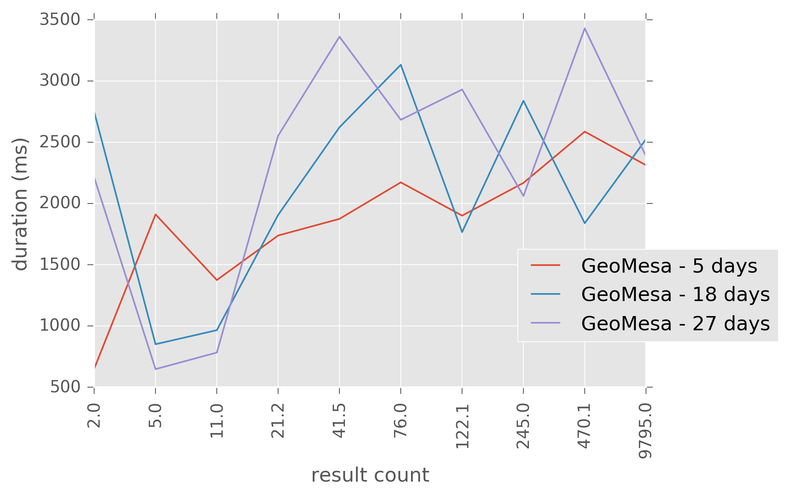

But for GeoWave, the performance seems to be correlated with the size of the temporal query bounds.

