# GeoMesa and GeoWave Comparative Analysis: Final Report

###  Abstract

> This document details the results of a comparative analysis between two open source geospatial big data frameworks: GeoWave and GeoMesa.
> A feature comparison and a set of performance tests with analysis are presented.
> We have concluded that despite a large set of overlapping features, most specifically around indexing
> and querying spatial and spatiotemporal data in Accumulo, the projects differ from each other in a variety of ways.
> Through analyzing performance test data, we make four conclusions about the performance characteristics
> of the current versions of the systems (GeoMesa 1.2.6 and GeoWave 0.9.3) for the use case of indexing spatial and spatiotemporal data in Accumulo:
> 1. GeoMesa performed better against queries with large result counts while GeoWave performed better
> on smaller result sets; 2. GeoWave performed better against queries with larger temporal bounds, while
> GeoMesa performed better when the temporal bounds were smaller (around a couple of weeks or less);
> 3. GeoMesa performed better in the non-point dataset use case, and
> 4. GeoWave outperformed GeoMesa in multitenancy use cases, where there are 16 to 32 queries being
> executed against the system in parallel. We also find the two systems perform reasonably well
> in all cases, and that neither system was dominant in performance characteristics. We provide recommendations
> for way the two projects can collaborate moving forward in light of this analysis.

## Introduction

GeoMesa and GeoWave are two open source projects that deal with large geospatial data.
At a high level these projects have solutions to many of the same types of problems.
Because of this overlap, it has been difficult for new users approaching the big geospatial data community to understand what
the differences are between these projects and what project should be used under what circumstances.
For some of their most overlapping functionality, for example indexing spatial and spatiotemporal data in Accumulo, the differences
between the two projects can be unclear to even veterans of big geospatial data processing.
This lack of clarity is a problem that this document aims to address.

In the summer of 2016, Azavea conducted a comparative analysis of GeoWave and GeoMesa in order to gain a deeper understanding of the those projects as compared to each other,
and to share that understanding with the big geospatial data community.
This document contains the results of our efforts and aims to provide a more clear picture of how the projects are different from each other and what use cases fit best to either project.
We hope this aids the big geospatial data community in gaining a deeper understanding of these two outstanding projects and allows better utilization of their functionality.

Along with an understanding how the projects are different from each other, this comparative analysis aims to provide information
and guidance to potential future collaboration efforts between the GeoWave and GeoMesa projects.

This document assumes prior knowledge about what the GeoMesa and GeoWave project are, and is not intended to be an introduction to those projects. For background information, please see the project websites:
- GeoWave: http://ngageoint.github.io/geowave/
- GeoMesa: http://www.geomesa.org/

## Feature Comparison

The GeoMesa and GeoWave projects contain many features, and not all of them overlap.
The Venn diagram below is not a complete list of features, but indicates the significant overlap of the core features of GeoWave and GeoMesa and some of the distinguishing features.

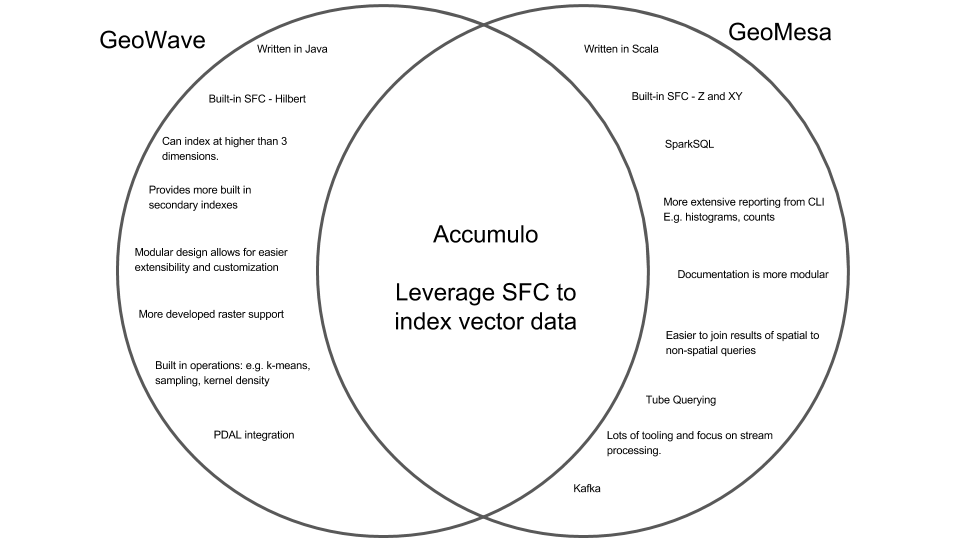

As is illustrated in the diagram, there is a major overlap when it comes to a core feature of the two projects, namely using space filling curves to index geospatial data in Accumulo.
However, there are many features that differentiate the projects from one another.
Below we describe some major differences.
A more detailed list of features can be found in _Appendix A: Details of GeoMesa and GeoWave features_.

### Generality of the Architecture

A major difference between the projects is the generality of the architectures when it comes to supporting various backends and indexing strategies.
GeoWave has a focus on being an N-Dimensional indexing mechanism for arbitrary backends.
The fact that this document focuses on its ability to handle geospatial data (2-Dimensional spatial and 3-Dimensional spatiotemporal data) is only based on the currently known GeoWave use cases.
However, the project aims at supporting data with arbitrary dimensionality.
GeoMesa, on the other hand, focuses specifically on geospatial data.

GeoWave specifically is designed around abstractions that remain agnostic about the storage and access implementations.
This could provide more flexibility for developing backend support, which might explain why GeoWave HBase support is more mature than GeoMesa's.
GeoMesa focuses on using GeoTools' abstractions, and thus is more dependent on GeoTools as a base library.
GeoMesa also focuses less on dealing with abstractions; this may have an effect that features written for one backend are difficult to translate to another backend.
However, dealing with less abstraction can be more straightforward, and some developers may find it easier to understand and work with the GeoMesa API.

### Language

GeoMesa is developed using Scala, and GeoWave is developed using Java.
Both Scala and Java are languages in which the source compiles down to Java Virtual Machine (JVM) byte code, which is execute on top of the same JVM.
This means that both projects can use the same dependencies, as can be observed by both project's reliance on GeoTools (a Java based geospatial library) for some of its features,
including a core data type: the GeoTools SimpleFeature.
However, the differences between the Scala and Java languages are many, and it remains one of the biggest differences between the projects.
Scala developers (such as the team who had conducted this comparative analysis) may find the GeoMesa API easier to work with,
since it is written in a language with which they are familiar.
Java programmers, on the other hand, might feel more at home with GeoWave.
GeoMesa, though written in Scala, implements a GeoTools interface that should allow Java developers to easily use GeoMesa functionality without having to write Scala.
However, if a developer wants to read the codebase or use the GeoMesa types directly, they might have trouble if they are not familiar with the Scala language.

### Accumulo Indexing

The two projects approach indexing in Accumulo in a similar way, but there are some key differences.

#### Choice of Space Filling Curve

GeoMesa supports the space filling curve indexes named Z-order and XZ indexes, while GeoWave supports Hilbert curves.
These space filling curve implementations have different properties that affect performance, such as the number of false positives returned and number of duplicate entries to be indexed.
You can read more about the differences in performance characteristics in _Appendix F: Details of Performance Test Conclusions_.

#### Sharding

By default, GeoMesa uses "sharding", a technique of prefixing indices with a discrete number of shard IDs in order to better distribute the data across nodes of a cluster.
There is a trade-off between increasing distribution while decreasing locality, which has an effect on performance.
GeoWave has the ability to shard, although in GeoWave it's called partitioning the data.
You can create a compound index with any of the GeoWave indexing strategies in order to partition.
Unlike GeoMesa, GeoWave partitioning is not enabled by default.
It is also configurable: you can decide on the number of partitions (i.e. shards) you want, and determine whether or not it's a round robin or hashing strategy that determines the partition ID.
GeoMesa's sharding seems to only use a hashing algorithm and a non-configurable number of shards.

#### Periodicity

To get around the problem of unbounded dimensions, such as time, the concept of "periodicity" is used in both GeoMesa and GeoWave.
This feature is similar to a shard, in that it prefixes an index with some ID.
A simple way to think of periodicity is that it bins each space filling curve into one period; for example, for one week.
In GeoWave, you can configure any dimension to have a periodicity of a configurable length.
With GeoMesa, you can configure the periodicity of the time dimension to day, week, month, or year.

#### Tiered indexing vs XZ index

GeoMesa uses an XZ index to handle non-point data, which allows the data to be stored at specific space filling curve resolutions
based on the the size of the geometry. GeoWave uses a technique called tiered indexing to handle this issue.
The technical differences between the two approaches are beyond the scope of this document; however it's important to note the difference in approach
because of the performance implications. One major difference between the two approaches is that the XZ approach does not store
any duplicates of data, while the tiered strategy can store up to four copies of an entry.

### Other features

This section gives a summary of features that are either found in one project and not the other, or are found in both projects with considerable differences.

#### Features Found in GeoWave and not in GeoMesa

- Integration with Mapnik
- Integration with PDAL for reading and writing point cloud data from/to GeoWave
- Time interval queries: The ability to index data that exists within an interval of time, and query for intersecting intervals
- Pixel-level subsampling: A visualization performance optimization that returns a subset of the resulting data based on pixel width
- DBScan clustering

#### Features Found in GeoMesa and not in GeoWave

- Tube selection analysis: Given a collection of points (with associated times), return a similar collections of points in terms of where the lines connecting said points exist
- Loose bounding box queries: Return all points where the index matches the space filling curve index query, and skip secondary filtering
- JSON configurable ingest tooling
- Cassandra backend (alpha support)
- Google BigTable support (marked experimental)
- Kafka GeoTools DataStore
- Cost-based query optimization
- Querying for a subset of SimpleFeature attributes and only returning the necessary data

##### Raster Support

Both projects have some level of raster support; however, GeoWave's raster support appears to be more mature than GeoMesa's.
According to GeoMesa's documentation, rasters must be pre-tiled to a specific size, projection, have non-overlapping extents, and must only single band rasters.
GeoWave supports multiband rasters, and includes tiling and merging strategies that allow you to ingest
rasters that are not pre-tiled. While GeoWave's raster support is more mature than GeoMesa's,
both project's support of raster data is not entirely mature; for instance, there is no support for anything but
spatial rasters (i.e. you cannot ingest spatiotemporal raster data such as timestamped imagery).

##### HBase Backend

Both projects have support for an HBase backend; however, GeoWave's support for HBase is more mature.
The GeoWave development team has expressed the amount of work that has gone into trying to match
the performance of the HBase backend to that of their Accumulo backend. The GeoMesa team expressed
that there has not yet been an equal level of effort to achieve relative parity between their
Accumulo and HBase backends.

## Performance Tests

### Methods

In this section, we briefly describe the technical means by which we were able to test the relative performance of GeoWave and GeoMesa for indexing SimpleFeatures in Accumulo.

The ultimate aim of the method of deployment, ingesting, and running the tests was to ensure results were both repeatable and could be iterated on quickly.
This implies these methods and the associated software are useful beyond the needs of this comparative analysis. All software associated
with the performance tests is open sourced under the Apache 2.0 license, and can be found at https://github.com/azavea/geowave-geomesa-comparative-analysis

#### Environment

For all deployments, the following versions were used:

| Software  | Hadoop | Spark  | Zookeeper | Accumulo | GeoMesa | GeoWave |
| --------- |:------:|:------:|:---------:|:--------:|:-------:|:-------:|
| Version   | 2.7.2  | 2.0.0  |   3.4.8   |  1.7.2   |  1.2.6  | 0.9.3-SNAPSHOT  |

For GeoWave, we used a snapshot version based on the code that can be found at commit SHA `8760ce2cbc5c8a65c4415de62210303c3c1a9710`

Across all tests, Amazon Web Service (AWS) Elastic Cloud Compute (EC2) instances were used.

|                | Instance Type | vCPU | Mem (GB) | Storage (Drives x GB) |
|----------------|---------------|------|----------|-----------------------|
| Query Server   | m3.large      | 2    | 7.5      | 1x32                  |
| Cluster Master | m3.xlarge     | 4    | 15       | 2x40                  |
| Cluster Worker | m3.2xlarge    | 8    | 30       | 2x80                  |


##### Deployment

A minimal working environment for either GeoWave or GeoMesa (assuming, as we do, an Accumulo backend) includes a number of interdependent,
distributed processes through which consistent and predictable behavior is difficult to attain.
Each of these pieces - i.e. Apache Zookeeper, HDFS, Accumulo - is a complex bit of technology in and of itself.
Their interoperation multiplies this complexity and introduces the race conditions one expects of distributed systems.

The solution to repeatability under this complexety that we arrived at was to develop a set of Docker containers which jointly provide the pieces necessary to bring up GeoWave and/or GeoMesa on top of Accumulo. A system of deploying the necessary components, which exists under the name GeoDocker, was improved to the point that we could consistently deploy Accumulo with the necessary components for GeoMesa and GeoWave to identical Hadoop clusters on Amazon Web Service's (AWS) Elastic Map Reduce (EMR). We opted to use the YARN, Zookeeper, and HDFS which is distributed on Amazon EMR to support GeoDocker’s Accumulo processes.

Pictured below is a rough diagram of the deployment used throughout our efforts.


The entire infrastructure for running queries and collecting timings results ran as a set of REST endpoints, created using the akka-http project.
Each endpoint represented a different test case, and timing results were taken from inside of the application to only measure GeoWave and GeoMesa performance.
Results were saved off to an AWS DynamoDB table for analysis, and included information about the duration of the query, the timing to the first result of the query,
and cluster configuration information. These query servers ran on AWS Elastic Container Service, and all query servers all sit behind an AWS load balancer to allow
for multitenancy testing.

#### Ingest

All data used for benchmarking these systems was loaded through custom Spark-based ingest programs.
Initial attempts to use the command line tools provided by each of the projects were met with a few notable difficulties;
this made writing our own ingest programs the simplest solution. Both teams were consulted about our ingest tooling to
verify their correct operation. Using our own version of ingest tooling has the disadvantage that
ingest timing results cannot be considered in the comparative analysis; however we determined that our Spark-based tooling was
the best path forward to provide consistent and successful ingests of our test datasets into both systems with
exactly the same data.

See _Appendix B: Details of Ingest Tooling_ for a more complete description of the ingest tooling.

We recorded the size on disk, number of entries, tablet server information and other details for each dataset ingested. These can be found in _Appendix C: Details of Ingested Data_

#### Querying

Queries were generated and submitted by the query servers in response to requests from clients.
This arrangement was chosen because it allowed for quick experimentation and prototyping of different parameters simply by tweaking requests while also ensuring that results
were as reproducible as possible. Results generated for this report should be conveniently reproducible and decisions about which results should be generated,
in what order, and how many times are largely configurable.

For a group of queries we will call the "Serial Queries" tests, the specific queries were run one at a time, so that the only load on the GeoWave or GeoMesa system was a single query.
For the "Multitenancy Stress" tests, a framework was used to produce a number of concurrent connections, so that we could test the multitenancy use case by querying the systems in parallel.

One feature we did not compare in our performance tests is the use of secondary indexing.
A comparison of that feature for both GeoMesa and GeoWave can be found in _Appendix A: Details of GeoMesa and GeoWave features_.

### Datasets

We conducted performance tests on three different data sets, which are described below.

#### GeoLife

This GPS trajectory dataset was collected as part of the Microsoft Research Asia Geolife project by 182 users in a period of over five years (from April 2007 to August 2012). A GPS trajectory of this dataset is represented by a sequence of time-stamped points, each of which contains the information of latitude, longitude and altitude. This dataset contains 17,621 trajectories with a total distance of 1,292,951 kilometers and a total duration of 50,176 hours. These trajectories were recorded by different GPS loggers and GPS- phones, and have a variety of sampling rates. 91.5 percent of the trajectories are logged in a dense representation, e.g. every 1~5 seconds or every 5~10 meters per point. Although this dataset is wildly distributed in over 30 cities of China and even in some cities located in the USA and Europe, the majority of the data was created in Beijing, China.

Text taken from the GeoLife user guide, found at https://www.microsoft.com/en-us/research/wp-content/uploads/2016/02/User20Guide-1.2.pdf

##### GDELT

GDELT—Global Data on Events, Location and Tone—is a new CAMEO-coded data
set containing more than 200-million geolocated events with global coverage for 1979 to
the present. The data are based on news reports from a variety of international news
sources coded using the Tabari system for events and additional software for location
and tone. The data is freely available and is updated daily. The GDELT data we have tested against
contains data up through August 2016.

Text taken from the ISA 2013 paper introducing GDELT, found at http://data.gdeltproject.org/documentation/ISA.2013.GDELT.pdf

##### Synthesized Tracks

We tested against a dataset supplied by a third party that that contain a total of 6.34 million synthesized tracks.
This set of tracks had a median length of 29.8 km, a mean length of 38.82 km and each track contains an average of 491.45 points.
There was approximately 35.88 GB of data compressed and stored as 729 Apache Avro encoded files.
The tracks were generated through a statistical process using Global Open Street Map data and Global Landscan data as inputs.
The dataset is available at `s3://geotrellis-sample-datasets/generated-tracks/`

Here is a view of the data for a specific time slice of the data, as shown in GeoServer:

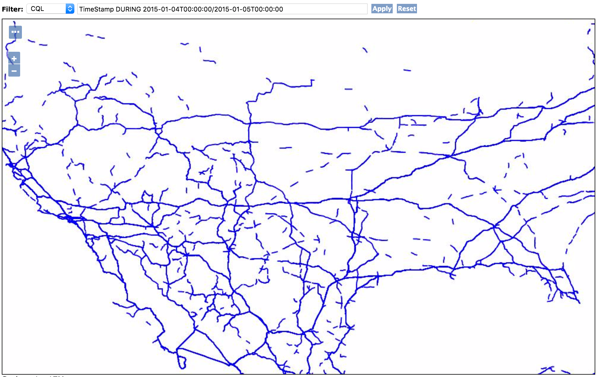

##### Track Length Stats (in miles)

|     count         |  min | max | mean | std dev | median | skewness | kurtosis |
|:-----------------:|:-----------------:|:-----------------:|:-----------------:|:-----------------:|:-----------------:|:-----------------:|:-----------------:|
| 2054751           |0.064998          |2839.198486       |38.829134         |115.975988        |29.791367         |15.466978         |266.782216        |

## Performance Test Conclusions

A complete analysis of the performance test can be found in the following appendices:
- _Appendix D: Details of Serial Queries and Results_
- _Appendix E: Details of Multitenancy Stress Tests_
- _Appendix F: Details of Performance Test Conclusions_

This section summarizes our findings from the "Serial Queries" and "Multitenancy Stress" tests.

A general conclusion that we reached was that differences in the query planning approaches can explain a variety of the performance diffferences seen.
GeoWave uses a sophisticated algorithm to compute its query plans, and GeoMesa uses a faster (but less thorough) algorithm.
The net effect is that GeoWave tends to spend more time on query planning, but with greater selectivity (fewer false positives in the ranges which must later be filtered out).

There are four major results that we believe can be explained by this difference in query planning algorithms:
- GeoMesa tends to perform better as the result set size of queries increases.
- GeoMesa tends to perform worse as the temporal window of queries increases. This result can be mitigated by the configuration of the periodicity of the GeoMesa index.
- GeoMesa consistently outperformed GeoMesa in the non-point use case.
- GeoWave consistently performed much better in multitenancy situations.

Details on how the query planning effects these results can be found in _Appendix F: Details of Performance Test Conclusions_.

One notable result found is that GeoWave performs better on the GDELT dataset if a hashing partition
strategy is used with four partitions. For analogous use cases, we recommend using the partitioning feature of GeoWave.

## Conclusions

Our comparative analysis between GeoWave and GeoMesa concluded that both are well constructed projects for
dealing with big geospatial data. Both projects should be considered when a big geospatial data solution is required.
We hope this document allows potential users to make the best choice when deciding what project to use.

If your use case includes a heavy and highly concurrent query load we would recommend GeoWave.
The performance issues we encountered with GeoMesa in this use case were significant.
As a qualification, multitenancy tests were the last sets of test we ran for this report, and GeoMesa team had limited time to respond to the issues.
It is unclear if these issues can be remediated via configuration or are fundamental. More work will have to go into diagnosing the them.
However, according to our experiences, we would recommend GeoWave for these use cases.

We also made the conclusion that GeoMesa is a more mature open source project than GeoWave. The difference is not vast,
but it is noticable enough to put into this report. For new users that want to get up and running with a solution quickly,
where both projects would satisfy the needs of the user, it is our recommendation to use GeoMesa. This is
because the documentation is more clear, and we experienced many fewer problems getting started with GeoMesa as compared
to GeoWave. We also feel the API is simpler to use for people new to the project. There is a large caveat to that point,
however: the Azavea team is mostly Scala developers. GeoMesa is written in Scala, and GeoWave is written in Java. This could
cause a bias in our opinion of the API complexity. Even taking that into account, we still believe GeoMesa to be
easier to work with. This opinion should not be seen as a discredit to the GeoWave team. They have been incredibly
responsive to any of our questions, and have created an advanced and useful project that I would recommend for many use cases.
It also makes sense when viewed in the history of the projects in the open source: GeoWave was open sourced after GeoMesa,
and while GeoWave has not yet started LocationTech incubation, GeoMesa has graduated as a full-fledged LocationTech project.
Also, the opinion that GeoMesa is a more mature open source project overall does not speak to the feature-level maturity:
for instance, the HBase and raster capabilities of GeoWave are more mature than GeoMesa's.

One important take-away from this experience is that the GeoMesa and GeoWave projects are not one tool, or feature, or capability;
they both exist as umbrellas under which a number of technologies exist. For instance, a Kafka Datastore is part of
GeoMesa, but there is no reason that users of GeoWave could not take advantage of that part of GeoMesa. In fact, you can
install GeoMesa and GeoWave iterators on the same Accumulo cluster, and save certain data in GeoMesa tables while saving other data in
GeoWave tables. These technologies are not incompatible, and we urge potential users of the software to not consider this
an "either/or" decision, and instead to look into what useful portions each project contains. This also highlights the importance
of the two projects collaborating; the more collaboration that exists between the two projects, the easier it will be for users to
pick out the features and technologies from either projects that help solve their big geospatial data problems.

### Recommendations for Collaboration

Our recommendation for how the two projects can collaborate in the future is to create external, collaboratively developed projects.
One or more separate projects could be created to contain common code, so that GeoWave and GeoMesa could depend
on these external  projects and collaboratively develop the common functionality together.
For functionality that is common between the projects, the developers of the GeoMesa and GeoWave projects could
code those features once and reuse each other's code.

However, the ideal of having common external libraries, collaboratively developed, would be difficult
to turn into a reality for a number of reasons.
Developing these external projects from existing overlapping functionality would be difficult
because existing functionality would have to be extracted and generalized in order to put into the common project.
In some cases, this would be untenable; for instance, though both projects develop Accumulo Iterators, there exists a number of optimizations
that are specific to each framework, and generalization would actually decrease performance of the frameworks.

There are existing features which would require much less effort to place into a common project.
For instance, the GeoMesa Kafka DataStore has minimal requirements on GeoMesa-specific code, and transferring
that feature from the GeoMesa codebase into a common codebase would be much less difficult.

Another difficulty in creating a common codebase lies in the fact that you would have two separate teams
of developers, who are used to programming in different languages under different architectures, now working
on the same codebase. Which language does that codebase choose, Java or Scala? What architecture and design
principals does it inherit?

These difficulties are not insurmountable. For instance, the GeoTrellis, GeoMesa and GeoWave projects
collaborated on the initial development of the LocationTech project SFCurve, for dealing with space filling curve
indexing. GeoMesa currently depends on that project, and it is on GeoTrellis's roadmap to depend on the project.
This will mark an example of two projects in the big geospatial data community relying on a collaboratively developed
external project. GeoTrellis, GeoMesa, and SFCurve are all developed in Scala which makes the
situation not completely analogous to a collaborative external project between GeoMesa and GeoWave.

There are two key areas where we would suggest collaboration:

##### Ingest tooling

GeoMesa's ingest tooling includes several data converters from formats such as CSV, JSON, and XML to GeoTools SimpleFeatures.
These converters are configurable through a JSON-like configuration file. Because the tooling converts data to a GeoTools SimpleFeature,
which both projects work with, either project could benefit from this feature. The GeoWave developers have expressed interest
in an external project that would support this type of ingest tooling for ingesting into both GeoMesa and GeoWave,
and it seems like a good point of collaboration.

Also, as part of this comparative analysis' performance testing, the Azavea team created
ingest tools that are based on Apache Spark, which use common code between the GeoMesa and GeoWave ingests.
This already exists as an external codebase which is demonstratively useful for ingesting
large datasets in both GeoMesa and GeoWave. The codebase is available for use and could
serve as a starting point for collaborative ingest tooling.

##### Common SimpleFeature serialization

Another common aspect of GeoMesa and GeoWave is the use of the Apache Avro
and Kryo serialization libraries to serialize SimpleFeatures. If both
projects were to rely on an external project to serialize and deserialize
SimpleFeatures, data would much more simply be exchanged through the different systems.

For instance, if GeoWave were to export data as a set of Avro files, those Avro
files would be able to be read into SimpleFeatures and ingested into GeoMesa.
In fact, because the serialization logic would be the same between projects,
an Accumulo table indexed by GeoMesa could be moved to
a table indexed by GeoWave by changing the Accumulo entry keys, leaving the values (the serialized SimpleFeatures) unchanged.

Serialization of SimpleFeatures is most likely of interest to the community
even outside of these two projects. If the projects and the community  were to standardize on specific
ways to serialize and deserialize SimpleFeatures, interopability in general would
benefit. Also any performance improvements to serialization within the external
project would benefit any project that used it.


# Appendix A: Details of GeoMesa and GeoWave features

__Note: This appendix refers to features in GeoMesa 1.2.6 and GeoWave 0.9.2__

## GeoMesa Feature List

### Data Ingest/Input

- command line tools for interacting with geomesa, which provides the ability to
  - Creating a geomesa datastore for accumulo
  - Ingest SimpleFeature data
    - Predefined, common `SimpleFeatureType`s are provided - gdelt,
      geolife, geonames, gtd, nyctaxi, osm-gpx, tdrive, twitter
  - Ingest rasters
    - Supported file formats: "tif", "tiff", "geotiff", "dt0", "dt1", "dt2"
    - Note: Raster support is limited; e.g. you are required to have the rasters pre-tiled, and they must be in the EPSG:4326 projection.
- tools for converting various serialization formats to `SimpleFeature`s for ingest
  - conversion mechanisms are specified by way of configuration files
  - formats supported:
    - delimited text (usually CSV/TSV)
      - Currently supported formats: "CSV" | "DEFAULT", "EXCEL", "MYSQL", "TDF" | "TSV" | "TAB", "RFC4180", "QUOTED", "QUOTE_ESCAPE", "QUOTED_WITH_QUOTE_ESCAPE".
    - fixed width
    - avro
    - json
    - xml
- support for streaming input
  - A datastore which listens for updates from a supported streaming source
    - A generic apache-camel based implementation of a streaming source
  - Hooks for updating GeoServer on stream update
- Storm/Kafka ingest (mentioned in "Other Features" below)


### Data Processing

- Spark integration
  - Generating `RDD`s of `SimpleFeature`s
  - Initial support for carrying out spark SQL queries to process geomesa data
- Hadoop integration
  - Reading data for use in a custom MapReduce job
- Processing on Accumulo backed GeoMesa instances
  - computing a heatmap from a provided CQL query
  - computing statustics from a CQL query
    - Currently supported statistics: count, enumeration, frequency
      (countMinSketch), histogram, top-k, and min/max (bounds).
    - Command line tools expose the following statistics:
      count, histogram, min/max (bounds), and top-k
  - 'Tube selection' (space/time correlated queries): This is a pretty sophisticated query mechanism. The basic idea is that, given a collection of points (with associated times), you should be able to return similar collections of points (in terms of where the lines connecting said points exist). Constraints on the query include the size of the spatial and temporal buffers (this is the sense in which we're dealing with 'tubes') and maximum speed attained by the entity whose points make up a given trajectory. Read more here: http://www.geomesa.org/documentation/tutorials/geomesa-tubeselect.html
  - Proximity Search: Given a set of vectors to search through and a set of vectors to establish proximity, return the members of the former set which lie within the (specified) proximity of members of the latter set
  - Query
    - Takes advantage of accumulo optimization to carry out geomesa queries
  - Find the K nearest neighbors to a given point
  - Identify unique values for an attribute in results of a CQL query
  - Convert points to lines: Convert a collection of points into a collection of line segments given a middle term parameter. Optionally break on the day of occurrence. This feature isn't really advertised.

### Indices

- Default Indices
   - XZ3
      - Notes: Default for objects with extent in GeoMesa 1.2.5.  Objects are indexed with a maximum resolution of 36 bits (12 divisions) into eighths.
   - XZ2
      - Notes: Default for objects with extent in GeoMesa 1.2.5.  Objects are indexed with a maximum resolution of 24 bits (12 divisions) into quarters.
   - Z3
      - Notes: For points, X, Y, and Time have resolutions of 21, 21, and 20 bits, respectively.
   - Z2
      - Notes: For points, X and Y both have resolutions of 31 bits.
   - Record
      - Notes: This is an index over object UUIDs.
- Optional Indices
   - Attribute
      - Notes: This is an index over SimpleFeature attributes.  One can create a join index over the UUID, date, and geometry.
   - ST
      - Notes: Spatio-Temporal Index, Deprecated
- Cost-Based Optimization (CBO): used to select which index to use for data ingested with multiple indexes.

### Output
- Accumulo output
  - A reader for directly querying a datastore in java/scala
  - Direct map/reduce exports
- command line tools for interacting with geomesa
  - Serialize and export stored features (vectors)
    - Supported export formats: CSV, shapefile, geojson, GML, BIN, Avro
- The ability to return only a subset of SimpleFeature attributes, reducing the size of return values.

### Other Features

- GeoMesa Native API
  - An alternative to the geotools interface for interaction with
    GeoMesa stores
- HBase backend
- Google BigTable backend
- BLOB backend
- Sampling of data for custom statistics
- Cassandra backend (alpha quality)
- A Kafka geotools datastore to pipe simplefeature types from producers, through kafka, to consumers
- Metrics reporting
  - Real time reporting of performance for GeoMesa instances. Supports multiple reporting backends - Ganglia, Graphite, and CSV/TSV

## GeoWave Feature List

### Input

- Ingest from the CLI
   - Ingest from filesystem -> GeoWave
   - Ingest from filesystem -> HDFS -> GeoWave
   - Stage from filesystem -> HDFS
   - Stage from filesystem -> Kafka
   - Ingest from Kafka -> GeoWave
   - Ingest from HDFS -> GeoWave
   - Notes: Requires plugins for each input file format, which are listed below in "File Formats Supported"
- Ingest Using the API
   - Bulk ingest via Hadoop
   - Piecemeal via a writer object
- File Formats Supported
   - avro
   - gdelt
   - geolife
   - geotools-raster (GeoTools-supported raster data)
   - geotools-vector (GeoTools-supported vector data)
   - gpx
   - stanag4676
   - tdrive
   - Via Extensions existing outside the GeoWave repository:
      - Landsat 8
      - OpenStreetMap

### Backends

- Accumulo
- HBase

### Integrations

- MrGeo (reading)
- GeoTrellis - (raster and vector, reading and writing)
- Via C++ bindings
   - PDAL (reading and writing)
   - mapnik (reading)

### Secondary Indices

- Numerical
- Temporal
- Textual
- User Defined
- See section on comparision of secondary indexing below for more details

### Processing

- k-means
   - via CLI or  Map-Reduce
- Jump Method (k-discovery)
   - via CLI and Map-Reduce
- Sampling
   - via Map-Reduce
- Kernel Density Estimation
   - via CLI or MapReduce
- Nearest Neighbors
   - via CLI or MapReduce
- Clustering
   - via Map-Reduce
- Convex Hulls of Clusters
   - via Map-Reduce
- DBSCAN
   - via Map-Reduce
- Spark Support
   - Ability to load and RDD of SimpleFeatures

### Output

- GeoServer Plugin
   - Includes the "decimation" feature, which allows large datasets to be shown interactively by subsampling at the pixel level.
- Hadoop integration
- Query
   - GeoWave DataStore: directly construct queries via the GeoWave API
   - GeoTools DataStore: construct queries via CQL
   - Ability to query data that has start and end times to find intersecting time intervals.


## Comparision of Attribute/Secondary Indices Feature

Often, spatial coordinates aren't the only important condition used in searching for and filtering through a dataset. Paramedics might want to find only accidents within their geographic region but they also might only want those accidents whose 'severity' attribute is 'fatal'. For certain applications it is a matter of practical necessity that such fields are indexed for quick lookup later and both GeoMesa and GeoWave provide some tools for these purposes. It is worth mentioning that the documentation provided by both projects suggests that secondary/attribute indices are an area that will receive future focus by their respective teams. In what follows, we briefly compare the features provided by each.

### GeoMesa Attribute Indices
In GeoMesa, any attribute can be indexed with a simple modification to the `UserData` which is associated with a `SimpleFeatureType`'s attribute. Each attribute index is stored in a single, associated `attr_idx` table. By fiat, let's imagine we have a `SimpleFeatureType` which describes car accidents as described above. The following code will add the appropriate information to our type so that, upon ingest, indexes are created to the values in our 'severity' field:
```scala
val sft: SimpleFeatureType = ??? // Our feature's schema
sft.getDescriptor("severity").getUserData().put("index", "join");
sft.getDescriptor("severity").getUserData().put("cardinality", "high");
```
As seen above, two properties on this attribute index are exposed through the `UserData`: 'index' (the type of index operation) and 'cardinality' (the number of distinct values).

#### Full/Join Indices
This type of index - 'full' or 'join' - determines how much data is replicated in the lookup table of the attribute index.
Full indices store the entire `SimpleFeature` of a record, allowing for quick replies to indexed-attribute queries without joining against the records table.
This is preferable under circumstances in which the attribute in question is regularly queried against and especially if the expected queries don't necessarily rely upon other fields for filtration.
The 'join' index stores only the data necessary for identifying the values in the records table which satisfy the provided predicate and is therefore useful for preserving storage resources.

#### Low/High Index Cardinality
The utility of this distinction is somewhat unclear. A high cardinality index has enough values that we can expect any filtering it does to significantly slim down the number of returned records
(thus, a query against a high cardinality index is given priority) while a low cardinality index seems to be ignored.
The user documentation under ['Data Management'](http://www.geomesa.org/documentation/user/data_management.html) notes (as of 10/01/2016) that "technically you may also specify attributes as low-cardinality - but in that case it is better to just not index the attribute at all."

### Client Code Difficulties
As of 1.2.6, it appears as though a library which is shaded in GeoMesa client code needs to be appropriately shaded in any ingest client code which intends to take advantage of attribute indices.
The fix for this issue can be found in [a commit](https://github.com/locationtech/geomesa/commit/2335a8856cc9b2388532209b4a6e61f925f2dd20) which made its way into 1.2.6.

### GeoWave Secondary Indices
Unlike GeoMesa, each secondary index gets its own table. Unlike GeoMesa, setting these secondary indices up is *not* a simple, two-line affair.
Figuring out how to actually use these secondary indexes was not obvious or straightforward from the documentation.

Here we modify the same `SimpleFeatureType` for extra indexing on ingest as above:
```scala
val sft: SimpleFeatureType = ???
val secondaryIndexingConfigs = mutable.ArrayBuffer[SimpleFeatureUserDataConfiguration]()
val textFieldsToIndex = Set("severity")

secondaryIndexingConfigs += new TextSecondaryIndexConfiguration(textFieldsToIndex.asJava)
val config = new SimpleFeatureUserDataConfigurationSet(sft, secondaryIndexingConfigs.asJava)
config.updateType(sft)
```

#### Index Cardinality
Unlike GeoMesa, cardinality of indices isn't a static feature configured by the user.
GeoWave's query planning and optimization attempts to determine the usefulness of an index for a given query based on the statistics it gathers on ingest.

#### Specialized Index Types
Another point of divergence between these projects in terms of extra index support is GeoWave's intent to support specialized indices
which can take advantage of various assumptions which are domain specific. Exact-match (as opposed to fuzzy) indices for text are not the
same as exact indices for numbers or dates or even fuzzy indexing (through n-grams) of that same text. The specialization here makes it possible
for GeoWave to index in ways that are sensitive to the types of data in question and even to the expectations of use (i.e. fuzzy vs exact and range-based vs exact queries).

#### Future Development
Documentation for GeoWave mentions the possibility of adding n-gram based fuzzy indexing of text fields (so that searches based on a subset of the data in a field can be used).
It appears as though this feature is already in the works, as an n-gram table is currently generated on ingest in the development branch of GeoWave.


# Appendix B: Details of Ingest Tooling

The datasets that were tested as part of the performance testing were ingested into GeoWave and GeoMesa through the development of a Spark based ingest tool.
This ingest tool has a common codebase for creating an `RDD[SimpleFeature]` out of the various raw data formats; it also includes Spark-based writers
for writing those `RDD[SimpleFeature]`'s into GoeMesa and GeoWave.
While the tooling uses GeoWave and GeoMesa functionality for writing the data
to Accumulo, and has been reviewed by the GeoWave and GeoMesa core development teams,
we felt it necessary to explain our reasons for not using the project's own ingest tooling for this effort.
This can be explained in the following reasons:
- Though both tools are relatively well documented, the large number of arguments necessary for even the simplest interaction can make it difficult for users who are unfamiliar with the tooling to not fall into traps and get stuck on errors. The unwieldy nature of both tools is likely fallout from the high degree of complexity in the underlying systems rather than any obvious inadequacy in the design of either project.
- We were not able to complete early experiments with GeoWave’s command line tooling for the out-of-the-box Map-Reduce ingest support. This was likely because of Hadoop classpath issues. Due to the size and scope of the data being used, local ingests were deemed insufficiently performant.
- Because the systems we were comparing for usability and performance are so complex, equivalent (to the extent that this is possible) schemas, which are encoded GeoTools SimpleFeatureTypes for our purposes, were desirable. Building simple features and their types explicitly within the body of a program proved to be relatively simple to reason about, and there were concerns about the ingesting data exactly matching. By using our own tooling we had better control over this aspect of the ingest process.

For these reason, we chose to develop our own ingest tooling.
A negative impact that this has is that we were unable to compare the performance of the ingest process between the tools.
A potential positive result that can be gained from this effort would be for ingest tooling codebase to be merged with GeoMesa and GeoWave ingest
tooling and concepts, as well as similar ingest tooling for projects such as GeoTrellis, to provide a common
platform for performing ingests into big geospatial data systems.

# Appendix C: Details of Ingested Data

## Geolife

Based on ingests into a cluster with 5 m3.2xlarge workers.

_Note: The performance test were performed against a 3 node cluster with a similar setup._

#### GeoMesa

- Disk Used:      1.68G
- Total Entries: 71.59M

###### Tables

| Tables                                | Number of Entries |
| ------------------------------------- |:-----------------:|
| `geomesa.geolife`                     |        10         |
| `geomesa.geolife_gmtrajectory_z3`     |    24.60 M        |
| `geomesa.geolife_records`             |    24.35 M        |
| `geomesa.geolife_stats`               |     8.00 K        |
| `geomesa.geolife_z2`                  |    24.55 M        |

###### Entries per tablet server

`11.95M, 11.67M, 11.67M, 11.95M, 24.35M`

###### HDFS usage report

DFS Used: 34.85 GB (4.84%)

#### GeoWave

- Disk Used: 1.45G
- Total Entries: 47.24M

###### Tables

| Tables                                                         | Number of Entries |
| -------------------------------------                          |:-----------------:|
| `geowave.geolife_SPATIAL_TEMPORAL_IDX_BALANCED_YEAR_POINTONLY` |      23.44M       |
| `geowave.geolife_GEOWAVE_METADATA`                             |        30         |
| `geowave.geolife_SPATIAL_IDX`                                  |      23.82 M      |

###### Entries per tablet server

The entires per tablet server server showed that all entires were on one of the 5 workers,
which would have dramatically affected performance. In order to correct that,
we changed the split size and compact the table.

To get more splits, we executed the following command in the accumulo shell, and then compacted the tables:

```
config -t geowave.geolife_SPATIAL_IDX -s table.split.threshold=100M
config -t geowave.geolife_SPATIAL_TEMPORAL_IDX_BALANCED_YEAR_POINTONLY -s table.split.threshold=100M
```

This gave the following entries per table:

`14.57M,8.81M,8.70M,2.92M,11.67M`


###### HDFS usage report

- DFS Used: 12.5 GB (1.74%)

## GDELT

Based on ingests into a cluster with 5 m3.2xlarge workers.
These stats were taken after ingest completed and compaction was done to all tables containing many entries.

#### GeoMesa

- Disk Used:       98.75G
- Total Entries:    1.22B

###### Tables

| Tables                                | Number of Entries |
| ------------------------------------- |:-----------------:|
| `geomesa.gdelt`                       |        10         |
| `geomesa.gdelt_gdelt_2devent_z3 `     |    406.51M        |
| `geomesa.gdelt_records`               |    406.51M        |
| `geomesa.gdelt_stats`                 |      7.88K        |
| `geomesa.gdelt_z2`                    |    406.51M        |

###### Tablet servers

| Tablet Count  | Number of Entries |
| ------------- |:-----------------:|
|      47       |    242.86M        |
|      44       |    234.28M        |
|      48       |    237.68M        |
|      46       |    241.10M        |
|      46       |    263.62M        |


###### HDFS usage report

DFS Used: 202.61 GB (28.16%)

#### GeoWave

We had problems ingesting GDELT, where the `geowave.gdelt_GEOWAVE_METADATA` table had way too many entries, all stored to memory,
and never flushing to disk although there was one minor compaction running the whole time. Any query or compact command
to that table would hang and timeout. We got around this issue by not saving any statistics to the table, by using the
`AccumuloOptions.setPersistDataStatistics(false)` method for our datastore options. An attempt was made to use the
`recalcstats` command in the geowave geotools, however we were unable to get this to work.

- Disk Used: 73.81
- Total Entries: 813.19

###### Tables

| Tables                                                              | Number of Entries |
| -------------------------------------                               |:-----------------:|
| `geowave.gdelt_SPATIAL_TEMPORAL_IDX_BALANCED_WEEK_HASH_4_POINTONLY` |      406.60M      |
| `geowave.gdelt_GEOWAVE_METADATA`                                    |           4       |
| `geowave.gdelt_SPATIAL_IDX_HASH_4`                                  |      406.60M      |

###### Entries per tablet server

| Tablet Count  | Number of Entries |
| ------------- |:-----------------:|
|      28       |    166.40M        |
|      26       |    151.95M        |
|      27       |    158.78M        |
|      29       |    170.14M        |
|      29       |    165.92M        |

###### HDFS usage report

- 156.6 GB (21.76%)

## Tracks

Based on ingests into a cluster with 5 m3.2xlarge workers.
These stats were pulled from a cluster that had undergone extensive performance testing.

#### GeoMesa

- Disk Used:       58.12G
- Total Entries:   19.59M

###### Tables

| Tables                                | Number of Entries |
|-------------------------------------- |:-----------------:|
| `geomesa.tracks`                      |        10         |
| `geomesa.tracks_records`              |      6.41M        |
| `geomesa.tracks_stats`                |        68         |
| `geomesa.tracks_xz2`                  |      6.33M        |
| `geomesa.tracks_xz3 `                 |      6.57M        |

###### Tablet servers

| Tablet Count  | Number of Entries |
| ------------- |:-----------------:|
|      45       |      4.22M        |
|      43       |      3.79M        |
|      45       |      3.66M        |
|      47       |      3.80M        |
|      44       |      4.13M        |


###### HDFS usage report

DFS Used: 120.6 GB (16.76%)

#### GeoWave

There is more entries here, which can be explained by the fact that GeoWave can store up to 3 duplicates per entry based on their indexing scheme.

- Disk Used: 106.24G
- Total Entries: 35.83M

###### Tables

| Tables                                                              | Number of Entries |
| ------------------------------------------------------------------  |:-----------------:|
| `geowave.tracks_SPATIAL_TEMPORAL_IDX_BALANCED_YEAR`                 |      18.04M       |
| `geowave.tracks_GEOWAVE_METADATA`                                   |          38       |
| `geowave.gdelt_SPATIAL_IDX_HASH_4`                                  |      17.78M       |

###### Entries per tablet server

| Tablet Count  | Number of Entries |
| ------------- |:-----------------:|
|      37       |      7.37M        |
|      41       |      6.59M        |
|      39       |      5.75M        |
|      37       |      6.26M        |
|      37       |      9.85M        |

###### HDFS usage report

- 218.93 GB (30.43%)

# Appendix D: Details of Serial Queries and Results

The following queries and results were executed serially, so that only one query was ever executing at a time on either the GeoWave or GeoMesa system.

This is not a complete list of the queries, which can be found in the source code for the service endpoints.
We considered and analyzed only a subset that we found interesting.

> Disclaimer
>
> These are simply a few ways of looking at the data that we found useful,
> after looking at the data in many different ways. We don't claim that these
> results are definitive, or that they tell the whole story. One reason for
> putting a repeatable process for others to perform these tests and analyze
> results (besides transparency, and the general spirit of FLOSS, and the
> techniques being more generally useful) is so that _you_ could perform the
> tests and dissect the results however _you_ think is best. What follows is
> a window into how we have dissected the results, and the conclusions we have
> drawn from those.

###### Notes
- In the following results, if we specify that outliers were removed, they were removed via the interquartile range rule.
- All maps were generated with `geojson.io`, basemaps © OpenStreetMap contributors

Throughout all results, unless otherwise noted, we follow this general color scheme:


### GeoLife

Test for GeoLife were performed on EMR 5.0.0 clusters of one m3.2xlarge master and three m3.2xlarge workers.
The GeoLife dataset was ingested with default 2D and 3D indexes for both systems.
See the appendix for details about machine specs and ingest results.

###### Spatial queries of Beijing

We used the Beijing geojson from Mapzen's borders dataset, which can be found in the resources of the `core` subproject. This represents the multipolygon seen below


We then queried the city of Beijing over the whole time of the dataset.
We tracked results for both iterating over the resulting SimpleFeatures.
Here are the timing results for that test, with outliers removed:

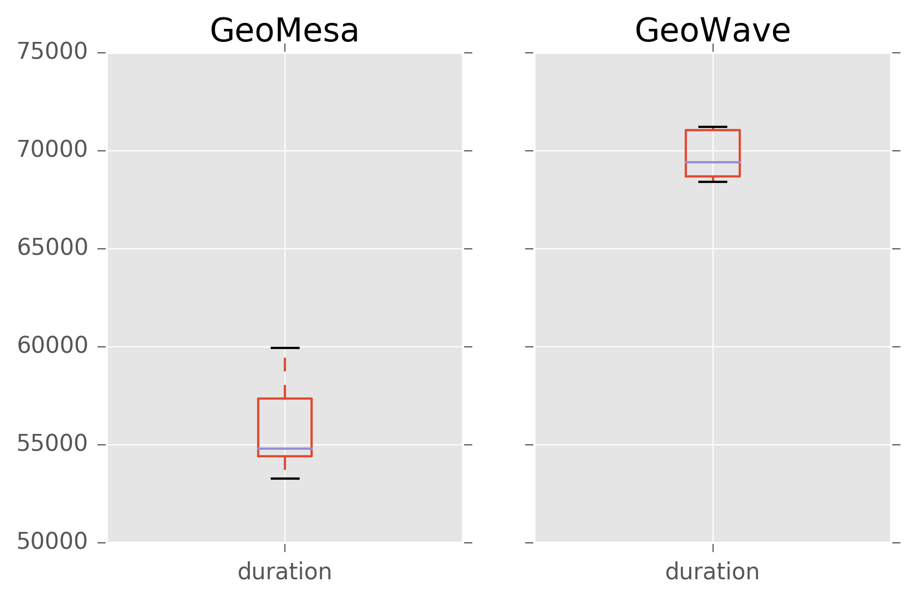

These queries take a long time; this makes sense, as they are iterating over __19,902,865 results__.

###### Spatial queries of central Beijing

To test on queries with smaller result set, we using `geojson.io` to draw a rough polygon around the center of Beijing.
We then performed spatial-only queries using this polygon:


This allowed us to track the iteration and count queries against a smaller spatial extent.
However, this query did not actually cut out too many results; the result set for this query included __16,624,351 results__.
In the following chart, outliers have been removed.


These two results show GeoMesa handling queries with large results faster than GeoWave, which is a result we've seen fairly consistently in our tests.

###### Spatial queries of bounding boxes across Beijing

This query cuts the bounding box of Beijing into `N` equal sized bounding boxes, represented by the tile coordinate `COL` and `ROW`.

For instance, running `N=32` would create bounding boxes that look like this:


We tested with `N=32`  `{ 2, 4, 8, 16, 32}`. This produced 1,024 unique queries.
417 were queries with 0 results, and were not considered.
103 of these queries did not produce the same result between GeoMesa and GeoWave;
a query for the entire bounding box of Beijing produces the same results, so it is unclear
why this mismatch occurs, and which system is incorrect.
Because these tests are focused on performance and not accuracy, these mismatched results are included
in the graphs below.

This graph plots the result count of each query against the duration of that query per system:


This shows GeoMesa having more variance over duration; however it does not give a good indication of trends.
If we plot a linear regression on the two set of points, we can see that although GeoMesa appears to have
more variance in query duration, the queries typically return faster from GeoMesa than from GeoWave, and this
trend becomes more pronounced as the number of results increases.

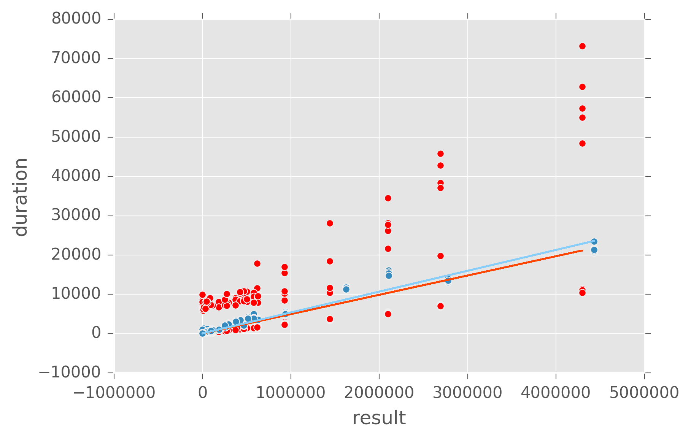

GeoMesa has a feature called "loose bbox" that allows you to trade performance for result accuracy;
it only uses the space filling curve to filter data and does no secondary filtering, so false positives
could be returned. The graph below includes a scatterplot and regression for the loose bounding box queries in yellow.


The following graph shows the regressions against queries returning less than 10,000 results.
It shows that even for queries with lower result counts, GeoMesa tends to slightly outperform GeoWave
for these spatial-only point data queries, for both loose and exact queries.


###### Spatiotemporal query results

In both systems, spatiotemporal queries (those with bounds in both space and time) hit a different table and indexing mechanism than the spatial-only queries described above.
To include a temporal aspect to our queries, we ran a query over the center of Beijing for the month of August in 2011. This returned __84,496 results__.
In the following chart, outliers have been removed.


We see that GeoMesa performs better in this query. If we plot the histogram of GeoMesa durations with outliers removed, for both
exact and loose (red and yellow, respectively), and compare it to the histogram of durations for GeoWave queries with outliers removed,
we see that there is a wider spread of timing results coming from GeoWave for this query.


### GDELT

Test for GDELT were performed on EMR 5.0.0 clusters of one m3.2xlarge master and five m3.2xlarge workers.

##### Spatiotemporal queries of areas around cities: City Buffers

For these queries, which we call the "city buffer" tests, queries are taken from center points corresponding to the following cities:
Paris, Philadelphia, Istanbul, Baghdad, Tehran, Beijing, Tokyo, Oslo, Khartoum, and Johannesburg. For instance, the Paris city buffers
look like this:


The queries were taken over a set of these durations: six months, two months, two weeks, and six days.

Below is a scatter plot of duration by query result count.

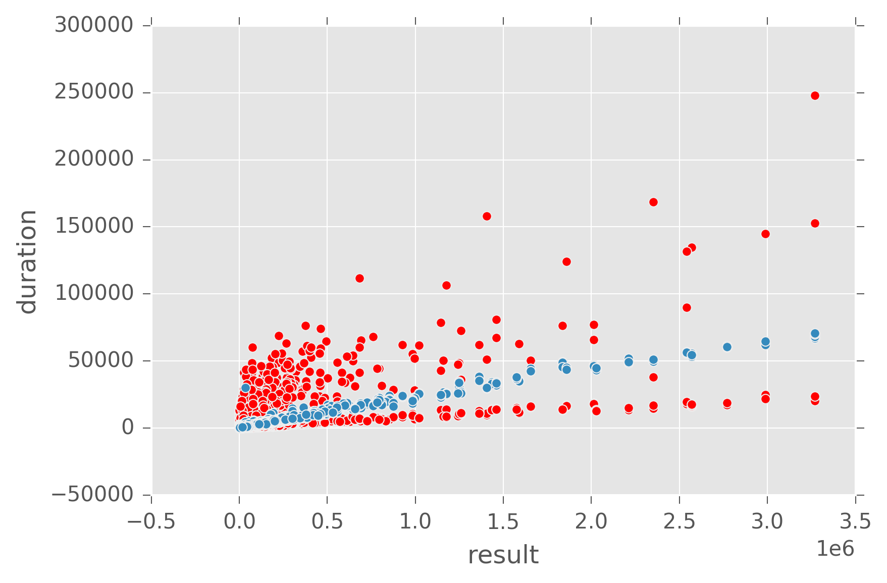

We can see that GeoMesa has much less consistent results than GeoWave. If we plot a linear regression on
this point sets, we'll get the following:


GeoMesa tends to be slower at returning these queries than GeoWave, until the queries return
a large number of results. According to the regression, after around 1 million results returned,
GeoMesa becomes faster than GeoWave. This is an imprecise result, but one that we have found
consistent over point datasets: GeoMesa generally does better with queries that produce
large result sets.

This next graph shows the mean duration of queries over all cities and all buffer sizes, for 14 day queries,
based on the result count of the queries. The x axis in this case represents a bin of result counts;
points were averaged according to a quantile-based discretization function of result count, which is represented here on the X axis as
the lowest result count of that grouping.

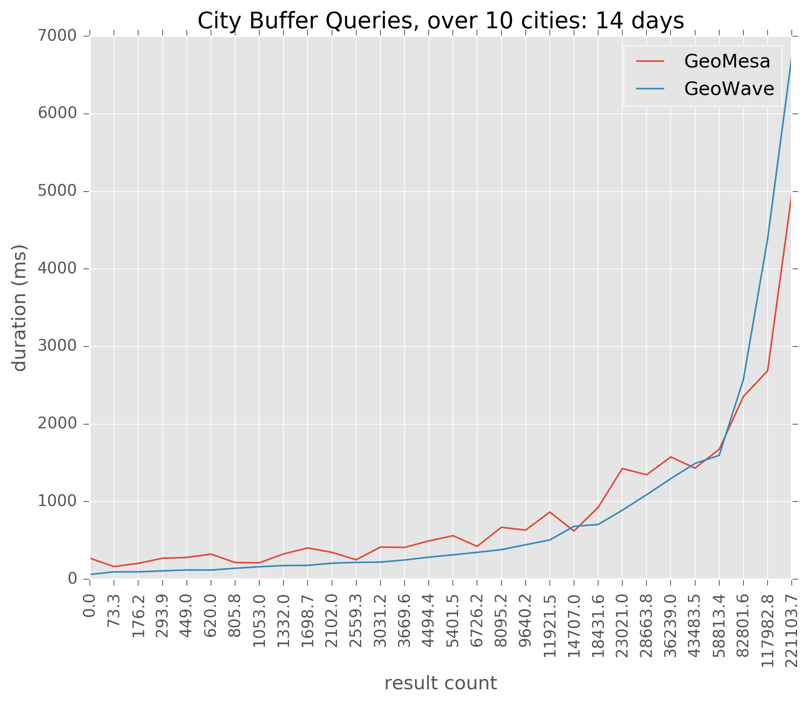

We see here that again GeoMesa appears to be slower than GeoWave, until a certain result count is reached,
after which it performs better.

If we take a look at the next graph, another pattern emerges. This graph moves the temporal bounds of
the query to 168 days.


We see GeoMesa performing worse than the 14 day case. In this case it
actually never crosses the threshold where it starts outperforming GeoWave based on result count (according
to this technique of averaging result count).

###### Index configurations

We hypothesized that some of the timing differences we were seeing here was because of differences in the configuration
of their indexing mechanisms. As described in the section comparing the index configurations, the default periodicity
for GeoMesa is one week, while in GeoWave it is one year. Also, GeoWave does not shard it's data by default.
To find out how this configuration might be affecting the timing results, we tested with both systems set
to having the following configuration:

- Both systems configured to have a periodicity of one month, with default sharding
- Both systems configured to have a periodicity of one year, with default sharding
- Both systems configured to have a periodicity of one year, with 4 shards being generated by a hashing algorithm

We attempted to test a configuration where both systems had a periodicity of one week, but this configuration
produces GeoWave results that were incorrect.

The last configuration in the list above produced improvements in timing results for the City Buffer queries, which we will explore below,
and be referred to as the "matched" index configuration.

This graph shows the durations of 14 day queries averages broken into the same result count quartiles.
We can see a marked improvement in GeoMesas results.


In the case of the 168 day queries, we see that although there is still a degradation of performance for GeoMesa,
it is not nearly as prominent as it was with the default indexing.


When we look at the overall timings based on result count, we can that GeoMesa seems to be slightly
outperformed by GeoWave until a certain result set size is reached.

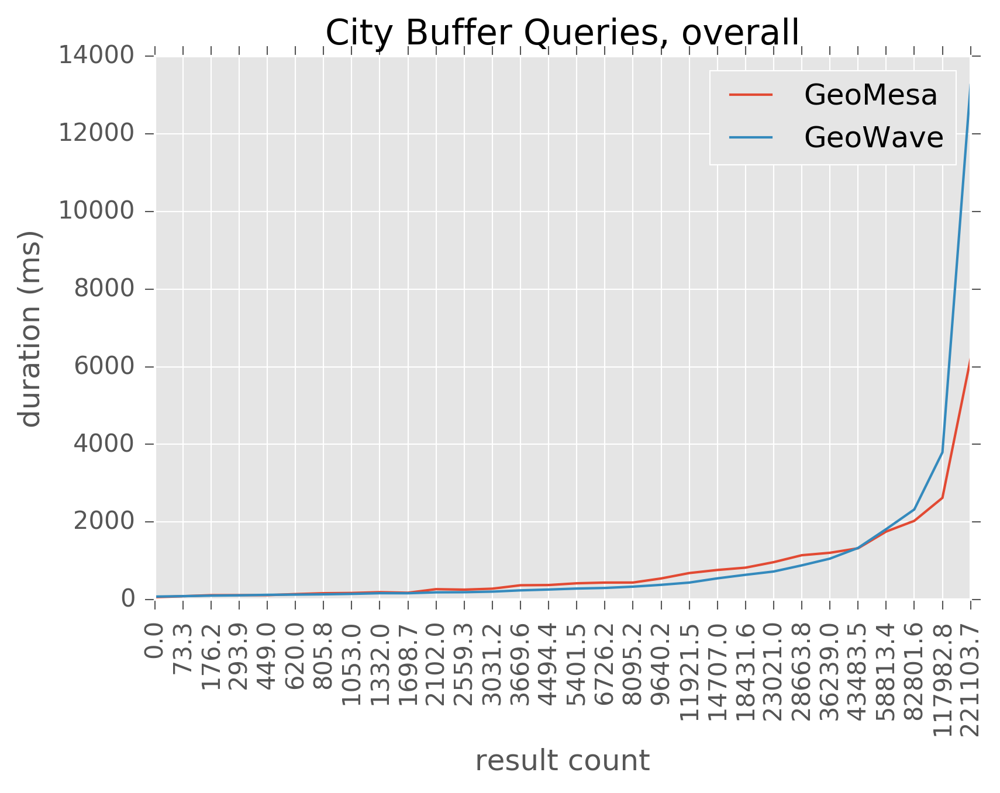

If we focus in on query durations with relatively lower result counts, and plot GeoMesa and GeoWave results
with both the default and the matched index configuration, we see that both systems improve with the matched
index configuration, and that GeoWave outperforms GeoMesa in this case for both index configurations.

<!--  -->


If we only look at queries with time bounds that are less than 30 days, we see the GeoMesa matched index configuration
performing the best out of that group.


When we only consider queries over 30 days, we see a more marked advantage of GeoWave performance.


<!--  -->
<!--  -->

Here is the duration of queries plotted over the temporal bounds of the query. We see that GeoMesa performs better for
queries with a small time window, and both GeoMesa and GeoWave show better performance with the matched index configuration.


Looking at the data in another way, we see that the size of the spatial component of the query
(shown in the x axis here in kilometers) does not have the same threshold-crossing effect as the temporal
component does, and that on average GeoWave outperforms GeoMesa across spatial queries.


Finally for the City Buffer tests, we look at how the scatterplot and regression
of durations over result counts changes between the default and the matched index configuration.


###### South America

We queried events within South america countries for three weeks of every month of every year from 2000 to 2016.


The results we found for this area of the world were unsurprising, with the matching index configuration
performing better in both systems than the default index configuration, and the effect of result count
having a greater effect on GeoWave performance than GeoMesa. The following chart is of the duration of
query execution over result size, with outliers removed.


### Synthesized Tracks

Test for Tracks data were performed on EMR 5.0.0 clusters of one m3.2xlarge master and three m3.2xlarge workers.

We performed queries against a range of bounding boxes over the continental United States of America.
We project a powers of 2 pyramid over this area and query from pyramid level 4 to 7, with temporal bounds being one of
5 days, 18 days, 27 days, or one month. The beginning of the temporal bounds was selected from the range of time for which
data existed.

We refer to the spatial aspect of the bounding box queries according to "levels", where each level refers to a powers of 2 pyramid
over the bounding box of the US. Below is a depiction of those bounding boxes, to give a sense of scale.

##### Level 4
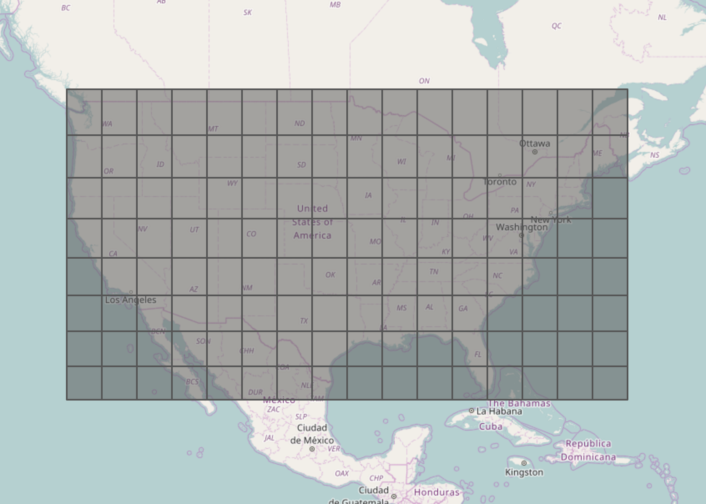
##### Level 5

##### Level 6

##### Level 7


There is an pattern of behavior exhibited by the query results for the generated tracks dataset that bears some mention.  Consider the following graphs:


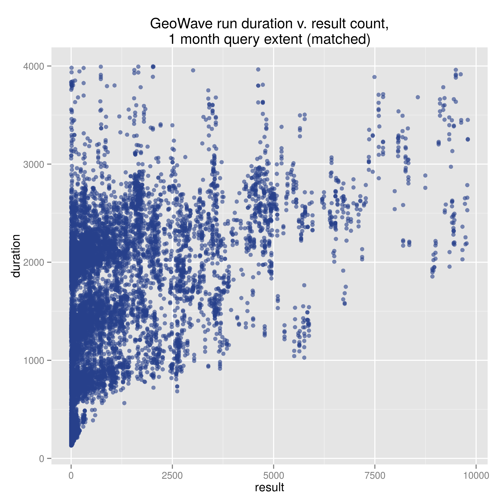

There is an indication of a gentle upward trend in both the case of GeoWave and GeoMesa; however, the GeoWave results exhibit an additional tendency for the returns to stratify.  This behavior is possibly an artifact of GeoWave's tiering strategy and would only appear in datasets with elements that exhibit a range of geometric extents, which is the case for this dataset.

Below is a chart that represents the distribution of durations for each system, as well as marking the mean duration.
It shows GeoMesa performing better on this dataset, which is consistent with our analysis.


If we look at the mean durations over result count groupings according to a quantile-based discretization function of result count,
we see GeoMesa consistently outperforming GeoWave.


To understand if there is a relationship between the temporal bounds of the query and performance, we
can look at the above chart broken down by the 5 day, 18 day and 27 day queries. For GeoMesa, we
do not see a clear behavior.


But for GeoWave, the performance seems to be correlated with the size of the temporal query bounds.

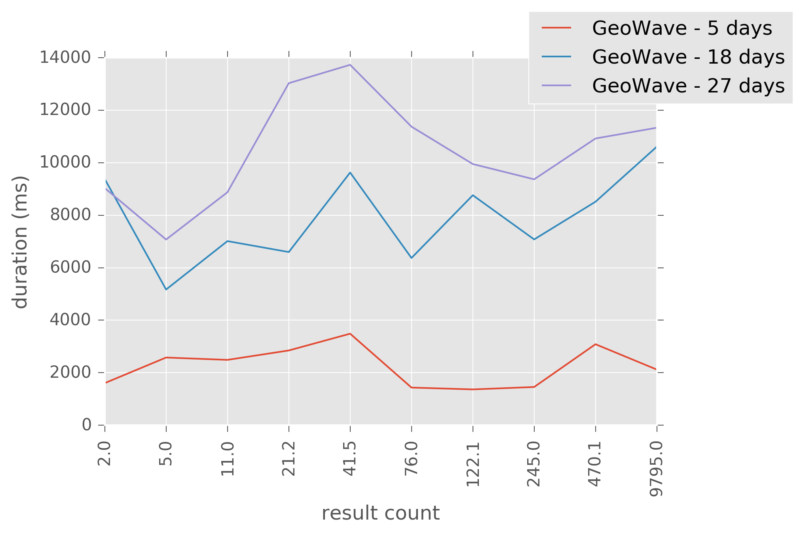

# Appendix E: Details of Multitenancy Stress Tests

In multitenancy tests we are interested in examining the behavior of the systems under heavy and dynamic query load.
This simulates a common deployment in which the Accumulo cluster is a shared resource backing a group of application servers.
The benchmark service acts as our application server, receiving the full query result-set and producing a digested view for the client.
We’ve formulate this test to make the Accumulo cluster and its SimpleFeature index the only contested resource.

## Summary

### GDELT

Under heavy dynamic query load against a GDELT store, GeoWave is better able to cope with high concurrent load producing stable and predictable performance.
In our specific scenario it is able to process a 3.5x higher request volume than GeoMesa.
We also found that GeoWave's return times increase roughly 1.5 times faster than GeoMesa's as the size of the result set increases.
On the other hand, GeoMesa's return times increase roughly 8.5 times faster than GeoWave's as the number of concurrent queries rises.
Additionally during this testing we have witnessed two instances where GeoMesa clusters entered degraded performance mode, where query duration seems to
increase permanently after a round of load testing.
We have not attempted to diagnose this issue but its effects are illustrated in our results.

#### Failure Analysis

The performance gap is further compounded because GeoWave is able to consistently complete queries covering large temporal spans (12 to 14 months) before the 60s client timeout.
When this does not happen the client connection times out and a new query is issued, which then must compete for resources with still executing scans.
Higher client timeouts cause the GeoMesa cluster to work under higher concurrent random scan load than GeoWave.
Highly concurrent random access scans cause tablet contention which is known to dramatically impact Accumulo performance.
This timeout cascade can be mitigated in deployment by tuning the allowed query load, cluster size, or canceling the scans when the client timeout happens.
Our benchmark services do not implement cancel-able queries so we are not able to comment on the difficulty of implementing such a feature.

### Generated Tracks

Generated tracks load tests allows us to test the performance of GeoMesa XZ3 vs GeoWave tiered Hilbert index.
Under heavy load with variance both over spatial and temporal selectivity both GeoMesa and GeoWave produced stable and reliable performance.
GeoWave delivers 60% higher request completion volume vs GeoMesa with 95th percentile response time being 7.5s.

## Test Setup

All queries are triggered by [Gatling load-testing tool](http://gatling.io) issuing HTTP requests against a load-balanced group of application servers.
Gatling allows us to keep the number of active concurrent query connections constant.
A connection is considered active until the benchmark services iterates over the query results set or a time-out of 60 seconds.

As with other tests the benchmark service saves the query timings, which happens even in the event of a time-out on the client/benchmark-server connection.
However, unlike the earlier test-ups all the queries per scenario are done against either GeoMesa or GeoWave - not both.
This produces a reliable and uninterrupted load on the target system.

## GDELT Test

The queries are executed against GDELT ingested into a cluster with 5 workers as in previous tests.
We reuse the City Buffers queries, as well as the queries against South American countries, randomly selecting parameters for spatial and temporal bounds.
Up to eight concurrent connections for each query group will be open with no pause between subsequent requests.
This is a very dynamic load test as the City Buffers  queries span up fourteen months and the South America queries will issue twelve `DataStore` queries for every HTTP request.

Because the Accumulo-backed `DataStore` can receive records from multiple tablet servers the application server network interface can easily become saturated.
These simulations increase the number of application servers relative to other tests to remove this bottle-neck and increase the query throughput until the cluster under test becomes the limiting resource.
Because small client queries trigger large query workloads we do not consider the connection between application server and Gatling client a limited resource.

### Test Results

We are interested in how concurrency impacts the duration of query execution.
The number of concurrent queries at the time of submission is calculated based on query start and end times as recorded by the application service.
Before each round of testing we verified that all clusters were idle, not undergoing any compactions or scans.


### Configuration 1: 1 Application Server
![mt1_duration_vs_concurrency] (img/multitenancy/graph_uncut_mt1.png)

This configuration is expected to degenerate; a single application server does not have the network bandwidth to pull the requested records and we see query duration spike well past usual levels.
From the client perspective this scenario produced cumulative timeout rates of about 50% for both systems.
After this round of testing GeoMesa cluster experienced an unexpected severity of degradation in query performance. This prompted us to bring up two replacements for future tests.


### Configuration 2: 4 Application Servers

![mt2_duration_vs_concurrency] (img/multitenancy/graph_100k_mt2.png)

With four application servers we expect the network to no longer constrain the query execution. Notably we see that GeoMesa is working against higher concurrency and producing higher delays.
These effects are likely mutually-reinforcing.
From the client we saw the query timeouts drop to ~5% for GeoWave and remain at ~20% for GeoMesa.
These results contain two GeoMesa clusters and we do not see the effects of performance degradation from the `MT1` test.

### Configuration 3: 6 Application Servers

![mt3_duration_vs_concurrency] (img/multitenancy/graph_100k_mt3.png)

We increase the application server count to six to verify that we have removed any performance impact from this parameter, as we expect the duration and concurrency distributions remain consistent, indicating that in both `MT2` and `MT3` results the cluster resources are the only remaining constraint.
However, at this point one of the two GeoMesa clusters started experiencing similar performance degradation as after `MT1` round of tests. This can be seen as two distinct distributions of GeoMesa results.

## Synthetic Tracks Test Specifics

This dataset is densest around continental United States and covers a single year, with track length biased to be short.
We project a powers of 2 pyramid over this area and query from pyramid level 4 to 8 with temporal selectivity ranging from 5 days to 1 month.
The generated query requests are biased towards lower levels of the pyramid, proportional to the number of grid cells at each level.
We test initially with 16, 32 concurrent connections.
Because we have seen from previous tests that six application servers is sufficient to handle query load from our cluster we only test against this configuration.

### Test Results

Increasing from 16 to 32 concurrent users produced nearly identical result counts per unit of time, 30 minutes.
However, we see that it has increased latency for each request.

Most interesting are the response time distributions, which explain the difference in overall throughput.
GeoWave index trades minimum response time for more consistent and on average faster results.

### GeoWave 16 Users
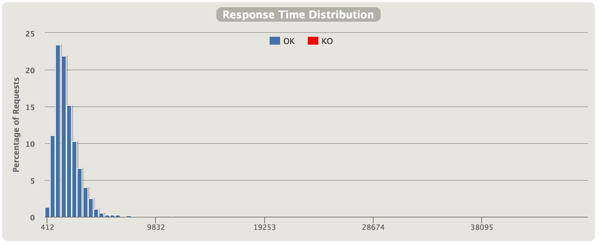

### GeoWave 32 Users
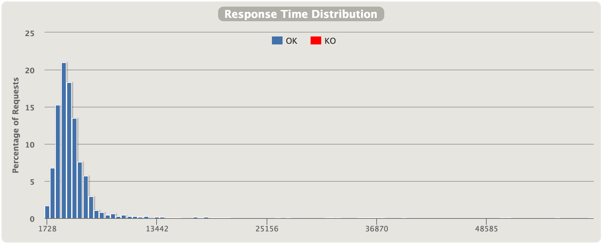

### GeoMesa 16 Users
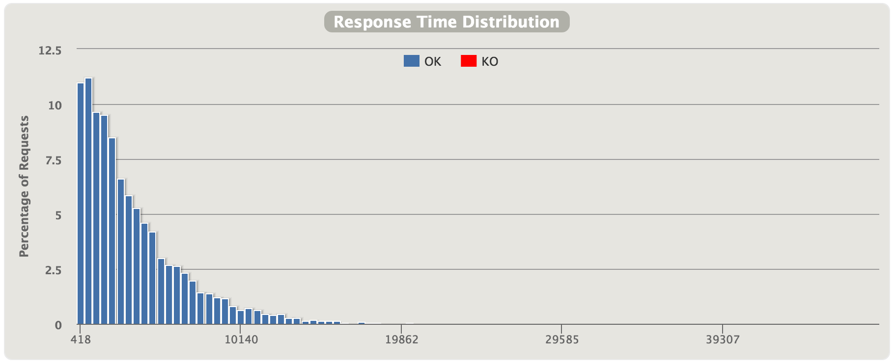

### GeoWave 32 Users
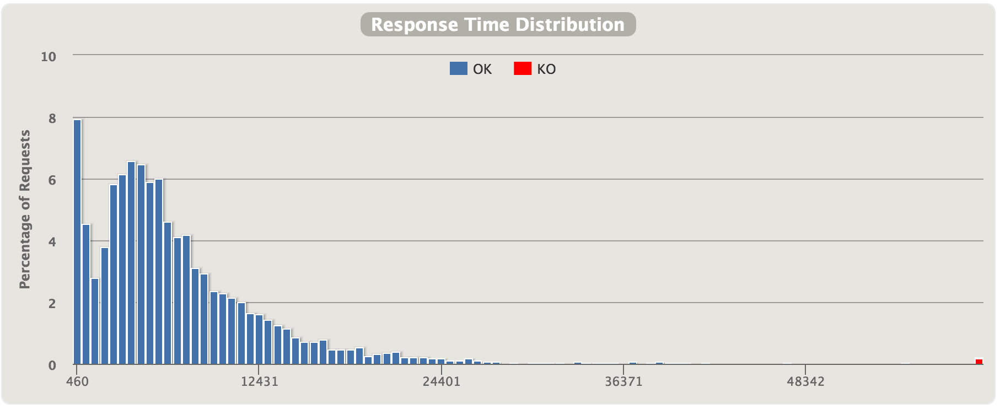


# Appendix F: Details of Performance Test Conclusions

In the course of our performance comparisons, we were able to characterize some scenarios in which the two systems displayed definably different behavior.
In this appendix, we define those scenarios, and we discuss some possible causes for those differences.
However, before doing either of those things, it is necessary to explain the set of experiments which provide the explanitory framework for this section.

## Query Planning

In this section, we discuss differences in performance that we noticed in experiments on the GDELT data set, which is composed of points.
At an abstract level, the point-storage mechanisms found in the respective systems are esentially equally capable.
(GeoMesa uses a Z-index and GeoWave uses a more sophisticated Hilbert-index, but that difference should not generate much of performance discrepency in-and-of itself.)
Since we did observe some systematic differences in performance, we must look beyond the modest high-level differences to try to find an answer.

Query-planning, the process of converting a query from the user into a collection of row-ranges to be submitted to Accumulo, is the highest-level significant algorithmic difference between the two systems that we have been able to identify (at least for point queries).
GeoWave uses a sophisticated [uzaygezen](https://github.com/aioaneid/uzaygezen) library to compute its query plans, and GeoMesa uses a faster (but less thorough) [sfcurve](https://github.com/locationtech/sfcurve) library.
The net effect is that GeoWave tends to spend more time on query planning, but with greater selectivity (fewer false-positives in the ranges which must later be filtered out).

## Query Planning Experiments

We performed a series of query planning experiments which mirror our GDELT experiments.
In an earlier section, we described at set of experiments in which we performed buffered queries around city centers using the GDELT dataset, here we used the excact same set CQL queries that were generated in the experimenet, but we gather different data.
That was done by isolating the parts of the respective systems responsible for query-planning and putting them into [stand-alone programs](https://github.com/azavea/geowave-geomesa-comparative-analysis/tree/master/query-planning).

We used those stand-alone programs to measure the amount of time spent on query-planning, as well as the results of the planning (the number of ranges generated and the lengths of those ranges).

### By Diameter

Allowing the diameter of the buffer around each city center to scale from 10 kilometers to 650 kilometers, we obtained the following results:

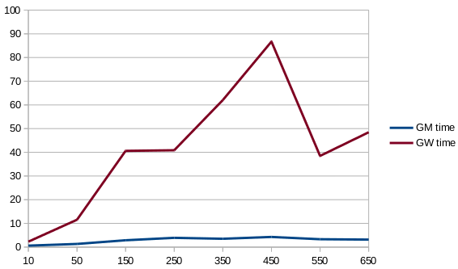

The first graphs shows the average amount of time (in milliseconds) that each system spent in the query-planning phase for all queries of the given diameter.
Here we observe that GeoWave takes much longer to complete this phase (although it should be noted that these experiments were performed on a differently-configured computer than GDELT experiment was, so the timings are not directly comparable).

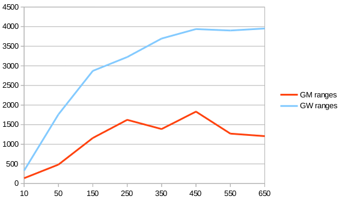

The next graph shows the number of ranges generated by the two systems.
We see that GeoWave generates many more ranges over the range of diameters.

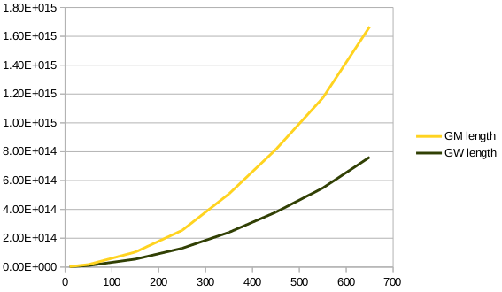

The third graph shows the total length of the ranges (difference between the respective starting and ending indices of the ranges) generated by the two systems.
Here we see that GeoMesa's total is much greater, as much as a factor of ten for larger query windows.
This particular number becomes relatively more important in areas of greater data density.
Taken together with the number of ranges (displayed in the second figure), this quantity gives us an idea of the selectivity of the query planner.

### By Time Window

The same data can also be broken-down according to the temporal width of the queries.

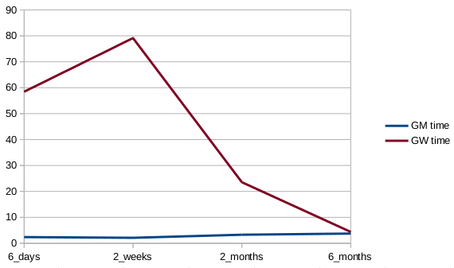

The first graph shows the query-planning time required by the two systems as a function of the temporal width of the queries.
Although the GeoMesa query-planning time is generally greater than that of GeoMesa, in this particular case we see that the two actually coincide at the "6 month" mark.
That fact will be important to us later.

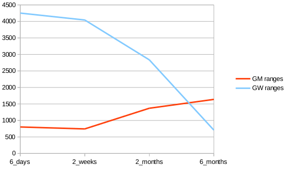

The second graph shows the number of ranges generated as a function of temporal widths.
Although GeoMesa normally has a larger number, in this case we see GeoMesa actually produce fewer ranges than GeoMesa at "6 month".
This is mildly surprising (based on a number of other experiments that we have performed) and will once again be important later.

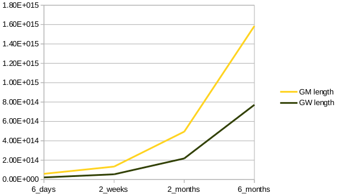

Finally, the last graph shows the aggregate query-plan length as a function of temporal window width.
As before, GeoWave remains consistently lower in this area.

## Performance Observations vis-a-vis Query Planning

In those experiments, GeoMesa tended to do better than GeoWave as the size of the result sets increased.
Examination of the respective query-planning strategies of the systems shows that GeoMesa submits fewer ranges of keys to Accumulo, but those ranges are wider in length.
These fewer-but-larger ranges could provide an advantage in this context.

Although GeoMesa tends to do better than GeoWave on the queries just described, GeoMesa's relative performance advantage lessens as the temporal widths of the queries increases.
GeoWave tends to produce sets of ranges whose counts goes down as the temporal window widens, whereas GeoMesa produces sets of increasing size.
Simultaneously, the sum of the widths of GeoWave's intervals are smaller than those of GeoWave.

Another pattern that we noticed is that GeoWave tends to do better on heavy load than GeoMesa on the GDELT dataset.
Once again looking to query-planning for an explination, the more-but-shorter ranges produced by GeoWave could provide an answer.
This creater selectivity could provide an advantage in which disk or network bandwidth is the limiting factor.
